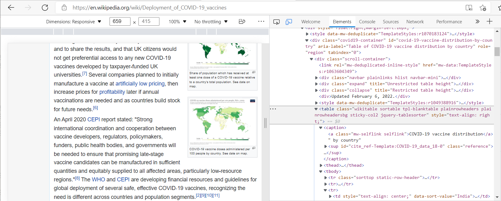

#### Reading in Web-Based Data, Part 1 {.tabset}

<details open><summary class='drop'>Packages Used in this Section</summary>
```{r, echo = TRUE, results = FALSE, message = FALSE, warning = FALSE}

# Packages used in this section
pkgs <- c("tidyverse",
          "readxl",
          "rvest",
          "htmltab",
          "stringr")

installed_pkgs <- pkgs %in% installed.packages() # check which packages are not yet installed
if (length(pkgs[!installed_pkgs]) > 0) install.packages(pkgs[!installed_pkgs],dep=TRUE) # if some packages are not yet installed, go ahead and install them...
lapply(pkgs, library, character.only = TRUE) # ...then load all the packages and their dependencies
```
</details>
<br>
<details open><summary class='drop'>Working with Web-Based Data in `R`, Part 1</summary>
This section focuses on using `R` to read delimited flat files (e.g., .csv) from the Internet, download and unzip compressed files, and scrape HTML tables from webpages.

We often get flat files from the Internet by clicking on a hyperlink or download button. With HTML tables we may simply copy the table and paste it into Excel. Why, then, should we bother writing `R` code to do these processes? Perhaps we simply want to document all of our data import and processing steps in a reproducible and portable `R` script. Or maybe the data update frequently and we don't want to manually download the data ad nauseam. Whatever the reason, `R` has solutions. But before we talk about those solutions, let's go over some good practices when it comes to getting data from the Internet.

</details>
<br>
<details open><summary class='drop2'>Using Web-Based Data Responsibly</summary>

- Check webpage security! Heed browser warnings about potentially unsafe sites. Don't download data from HTTP connections (stick with HTTPS).

- Respect copyrights and webpage terms and conditions for using data. Understand [Creative Commons Licenses](https://elearnhub.org/what-does-creative-commons-mean/#:~:text=What%20does%20%E2%80%98Creative%20Commons%E2%80%99%20mean%3F%201%20ATTRIBUTION.%20Sometimes,4%20NO%20DERIVATIVES.%20No%20changes%20at%20all.%20).

- Don't burden a webpage server with repeated downloads of the same data. Especially when working with large files, download the data to your computer and work with it from there.

- Understand the data you're using. Make sure it's from a trusted source, and verify the quality of the data before you use or share it.

- When web services require user authentication via API tokens, usernames, passwords, etc., don't put this sensitive information directly in an `R` script that may be shared with others. Instead, save website passwords and API tokens in an .Renviron file to be sourced by the `R` script.

With that, we're ready to get started.

</details>
<br>
<details open><summary class='drop'>Reading in Flat Files (e.g., .csv, .txt)</summary>

If we have the URL for a .csv or .txt file, we can read it into `R` as we would read any flat file from a file path on our computer. The first argument for these functions (e.g., `readr::read_csv()`) is typically `file =`, which can be an absolute file path, a file path relative to the current working directory, **OR a complete URL**. For example, we can write `dat <- readr::read_csv("./data/butterflies.csv")` to reference a file path on our computer or `dat <- readr::read_csv("https://raw.githubusercontent//butterflies.csv")` get the data from a webpage.

The example below uses data on National Park Service visitor counts since 1904. These data were originally accessed from the US Department of the Interior National Park Service’s Integrated Resource Management Applications data portal (https://irma.nps.gov/), but here we read the data from a [Tidy Tuesday Project](https://github.com/rfordatascience/tidytuesday/tree/master/data/2019/2019-09-17)
```{r, echo = TRUE, eval = FALSE, warning = FALSE, message = FALSE}
### NOTES:
# 1. We can feed the URL directly into the `readr::read_csv()` function instead of first assigning it to a variable name.
# 2. For other types of flat files (e.g., fixed width or tab-delimited), simply replace `read_csv` with the relevant function

# Specify URL where file is stored
file_loc <- "https://raw.githubusercontent.com/rfordatascience/tidytuesday/master/data/2019/2019-09-17/national_parks.csv"

# Read in the file from the URL as we would read in a file stored on our computer
dat <- readr::read_csv(file_loc) 
head(dat)
```
 
Additional notes on reading flat files in `R`:

1. The `fread()` function from the `data.table` package can be much faster than base R or `dplyr` functions for reading in very large flat files in table format. The resulting object is classified as both a `data.table` and a `data.frame`, which means we can wrangle the data with either `data.table` or `dplyr` functions. For very large data sets, using `data.table` functions on `data.table` objects is faster and more efficient than is working with `data.frame` objects and `dplyr` functions. But check out the `dtplyr` package, which converts `dplyr` syntax to `data.table` syntax, combining some advantages data tables with the familiar syntax of `dplyr`.

2. If a very large flat file includes a lot of non-numeric data, the `vroom::vroom()` function can be much faster than `data.table::fread()` for reading the file into an `R`. The resulting object is a `tibble`.

</details>
<br>
<details open><summary class='drop'>Downloading and Saving Files</summary>

Instead of reading a file directly into an `R` object, we can first download the file to a specified file path, then read from that file path into `R`. This option is useful if we are trying to read a file with a function that does not accept URLs. Even if a function DOES accept URLs, it is generally good practice to separate the step of downloading files from working with them, especially when working with large data files. As a general rule, we want to minimize the number of times we may re-download a file and burden the servers.

The `download.file()` function in the example below allows us to download various file types from the Internet and save them to specified file paths on the computer.
  
```{r, echo = TRUE, eval = FALSE, warning = FALSE, message = FALSE}
### NOTES: 
# 1. Setting the `download.file()` `method` argument to `libcurl` allows access to ftps:// URLs and also allows simultaneous downloads, i.e., the `url` and `destfile` arguments can have character vectors with multiple items
# 2. Check out `?download.file` for other useful arguments, e.g., setting `timeout` length

# Specify URL where file is stored (alternatively, We can feed the URL and destination paths directly into the `download.file()` function)
file_loc <- "https://raw.githubusercontent.com/rfordatascience/tidytuesday/master/data/2019/2019-09-17/national_parks.csv"

# If we want to save the file in a subfolder of the current working directory, make sure the subfolder exists
if(!dir.exists("./downloads")) dir.create("./downloads")

# Specify the destination path where file should be saved
dest <- paste0("./downloads/park_visits_", gsub("-", "", x = Sys.Date()), ".csv") # saves file with attached date in yyyymmdd format (optional)

download.file(url = file_loc, destfile = dest) # save the file to the specified destination
```

</details>
<br>
<details open><summary class='drop'>Reading in Compressed Files</summary>

We can use the `download.file()` function to download a compressed file (e.g., a zipped shapefile) to a specified file path. Then we can use`unzip()` to look at the contents of the compressed file, extract and read in file(s) of interest, and/or save extracted files to a specified file path. This process works with compressed files for which we have a URL.

The typical functions for reading flat files in R (e.g., `read.table()`, `read.csv()`, `readr::read_delim()`, `readr::read_csv()`, etc.) supposedly can read compressed files, but I often get error messages with them unless I download then `unzip()`.

If we have no need to keep a compressed file after extracting its contents and/or reading its content(s) into an `R` object, we can download the file into a temporary directory that will be automatically cleared when we exit the R session. 

The example below uses data from a survey focusing on people's anticipation about social distancing rules and firm closures during the 2020 COVID-19 pandemic. SOURCE: Lange, Fabian and Lars Vilhuber. 2020. "Uncertainty in times of COVID-19: Raw survey data [dataset]." Available at https://labordynamicsinstitute.github.io//covid19-expectations-data. 

```{r, echo = TRUE, eval = FALSE, warning = FALSE, message = FALSE}

### NOTES: 
# 1. On Windows, if the `mode` argument is not supplied and the URL ends in one of .gz, .bz2, .xz, .tgz, .zip, .jar, .rda, .rds or .RData, then the default mode is "wb" (for reading compressed files) -- but it never hurts to set the argument explicitly.
# 2. The `unzip()` function extracts all files unless one or more files is specified with the `files` argument
# 3. To unzip a single file, we can use unz() instead of unzip() -- but check out `?unz` for the correct argument names

# Specify URL where file is stored
file_loc <- "https://www.zenodo.org/record/3966534/files/labordynamicsinstitute/covid19-expectations-data-v20200622-clean.zip?download=1"

# Specify the destination where file should be saved. In this example we save the compressed file to a temporary directory that will be cleared after we exit the current `R` session. Alternatively, we could have provided an actual file path, e.g., `tmp <- ("./my_downloads/butterflies.zip")
tmp <- tempfile()

# We can see the file path of the temporary directory by typing `tempdir()` in the consoloe

# Download the file
download.file(url = file_loc, destfile = tmp, mode = "wb") # set mode to "wb" if the file is compressed (but okay if omitted because this is automatically set as the default mode when the file has a recognized compressed file extension -- see Note # 1 above)

# Now we can look at file names and sizes (in the temporary directory, AFTER downloading) without extracting the files
unzip(zipfile = tmp, list = TRUE) %>% head(30)

# Hmmm...there are a lot of files, so let's try again but specifically searching for a .csv or .xlsx to read in
unzip(zipfile = tmp, list = TRUE) %>%
  dplyr::filter(., grepl(".csv|.xlsx", Name)) %>%
  dplyr::pull(Name)
# Looks like we have 65 files that are .csv or .xlsx

# Read in the (unzipped) actual file of interest and call it 'dat'. I'm picking an .xls file for this example just for practice. But in general, it's faster and "cleaner" to read data in .csv or .tsv format if those alternatives are available 
dat <- readxl::read_excel(unzip(zipfile = tmp, files = "labordynamicsinstitute-covid19-expectations-data-fd6cf45/auxiliary/aggregage_agegrp_ca.xlsx")) 
head(dat) # examine the file

# We can extract the files and save them to a specified location. Remember that we had saved the zipped file to a temporary directory, so that file will be automatically deleted when we close the `R` session. But these extracted files will remain where we specified in the code line below. 
# If the subfolder `downloads` doesn't already exist, it will be created automatically by the `unzip()` function.
unzip(zipfile = tmp, exdir = "./downloads/example_extracted_files_folder")
```

<div class="alert alert-info">
  <strong>CHALLENGE:  Practice reading in flat files and compressed files from the Internet.</strong>
  
  One way to easily find practice files for this challenge is with [Google Dataset Search](https://datasetsearch.research.google.com/). In the search bar, enter a topic (e.g., 'invasive plants') for which you would like to find a data set. Filter the search with these criteria:
  
  - For `Download format`, select `Tabular` and `Archive`
  - For `Usage rights`, select `Non-commercial use allowed`
  
  The search results will tell you the format of the available data and provide a link to the relevant webpage from which you can download the data. You can usually get the URL for the data by right-clicking on the data hyperlink and then selecting 'Copy link address'.
  
  If you find other file types that interest you (e.g., XML), use the Internet and `R` help files to figure out how to import and read them into R.
  </div>

</details>
<br>
<details open><summary class='drop'>Reading in HTML Tables</summary>

Sometimes the data we want to work with are displayed in an HTML table on a webpage, rather than accessible via a download link or a REST API (more about that in later). One way to get the data would be to copy-paste from the webpage into an Excel worksheet, then read the worksheet into `R` (or save as .csv, then read into `R`). Alternatively, we can automate the process by coding it into an `R` script. 

This [webpage](https://css-tricks.com/complete-guide-table-element/#:~:text=The%20%3Ctable%3E%20element%20in%20HTML%20is%20used%20for,sense%20in%20spreadsheet%20software.%20Essentially%3A%20columns%20and%20rows.) has a nice explanation on how to understand the HTML code for `<table>` elements. It's a useful primer for understanding what we will be doing next.

In the examples below we pull data from HTML tables on this [Wikipedia page about COVID vaccine deployment](https://en.wikipedia.org/wiki/Deployment_of_COVID-19_vaccines).

<details open><summary class='drop2'>Example 1.  Using `rvest` and `htmltab` to read in an HTML table</summary>

```{r, echo = TRUE, eval = FALSE, warning = FALSE, message = FALSE}
# NOTES:
# 1. With `rvest::html_table()` we can also specify the node by number(s), e.g., `html_table(tabs[c(2, 6)])` or `html_table(tabs[[2]])`
# 2. If we don't specify a node by number, `rvest::html_table()` will convert all the tables into tibbles and combine them into a list of tibbles.

# URL for webpage
page_url <- "https://en.wikipedia.org/wiki/Deployment_of_COVID-19_vaccines"

# First, read in an HTML page and then look in that object for HTML elements that are defined as `<table>`
html_pg <- rvest::read_html(page_url) 
tabs <- rvest::html_elements(html_pg, "table")
# `tabs` may show more tables than you were expecting to see. Remember that HTML elements classified as `<table>` may refer to any content laid out in tabular format--not necessarily numeric data tables

# Use `str_detect()` to find which table has HTML text matching the title (caption) of the table we want. This code returns a logical vector for each element in `tabs`, indicating if it has string matching the title we specified
match_vec <- tabs %>% 
  rvest::html_text() %>% 
  stringr::str_detect("COVID-19 vaccine distribution by country")

# Now use `match_vec` with `html_table` to read in the table of interest

this_table <- rvest::html_table(tabs[[which(match_vec)]]) 
head(this_table) 

# Notice that`this_table` includes a column with no heading and with only NA values. If we look at the table on the webpage, we see that this first column actually had no heading and had flag icons for values. This is why we see that column in our tibble/data.frame. In addition, the column headings include the superscripts `[a]` and `[b]`, which we don't actually want in our column headings

# A relatively new package, `htmltab`, has a function that works quite well when it comes to giving us a "clean" table. We will provide this function with the URL and with the table rank we had already identified with string matching.

this_table2 <- htmltab::htmltab(doc = page_url, which = which(match_vec))
head(this_table2)

```
</details>
<br>

<details open><summary class='drop2'>Example 2.  Using `htmltab()` and HTML developer tools to read in a specific HTML table</summary>

If we are having difficulty using `rvest` functions to find the table we want, we can instead inspect the source code of a webpage to identify the XPath (rank) for the table we want. However, if the rank of the table changes in the future (e.g., the webpage is updated with additional tables) then we would need to update our code with the new table XPath information. 

One way to find the XPath for the table, using Google Chrome or Microsoft Bing developer tools:

1. On the webpage, hover your mouse over the table of interest and (right click) > Inspect

2. In the developer tools 'element' view you should see a line of HTML code highlighted (corresponding to what you hovered over on the webpage). Depending on where in the table you clicked, you may have to go up a few lines of code to find the start of the table (look for "<table class = "; a gray vertical line to the left of the HTML code should also lead you up to where the table starts). Check the HTML caption for the table--if a caption exists--to make sure you have the right table. (NOTE: You can also use the 'inspect element' icon in developer tools and highlight a part of the table, to find the corresponding HTML code)



3. Click on the HTML code for the table class to highlight it. Then (right click) > Copy > Copy full XPath

4. Paste the XPath into your `R` script and assign it to a variable name, e.g., `xp_full`

Once you have found the XPath for the table of interest, you can use it in the `htmltab()` function as shown below.
```{r, echo = TRUE, eval = FALSE, warning = FALSE, message = FALSE}

# URL for webpage
page_url <- "https://en.wikipedia.org/wiki/Deployment_of_COVID-19_vaccines"

# The XPath below was determined by following the steps above re: using your web brower's developer tools
xp_full <- "/html/body/div[3]/div[3]/div[5]/div[1]/div[6]/div/div/table" 

this_table <- htmltab::htmltab(doc = page_url, which = xp_full)
head(this_table) # Note that we seem to have an extra column. If we look at the HTML code for the table, we see that the `Doses(millions)` tab actually spans two columns. First column contains the integer, second column contains the decimal point and one value past the decimal point. We will want to paste the values in those two columns together.
```
</details>
<br>

<details open><summary class='drop2'>Example 3.  Dealing with a common difficulty - tables with nested headers</summary>

On the COVID-19 vaccines webpage, the table captioned "COVID-19 vaccine production by country" has nested headers. Let's see what happens when we read it into `R` with `rvest::`html_table()` versus `htmltab::htmltab()`

```{r, echo = TRUE, eval = FALSE, warning = FALSE, message = FALSE}
# URL for webpage
page_url <- "https://en.wikipedia.org/wiki/Deployment_of_COVID-19_vaccines"

html_pg <- rvest::read_html(page_url)
tabs <- rvest::html_elements(html_pg, "table")

# Use `str_detect()` to find which table has HTML text matching the title (caption) of the table we want. This code returns a logical vector for each element in `tabs`, indicating if it has string matching the title we specified
match_vec <- tabs %>% 
  rvest::html_text() %>% 
  stringr::str_detect("COVID-19 vaccine production by country")

# Let's first try using `rvest::html_table()`
this_table <- rvest::html_table(tabs[[which(match_vec)]]) 
head(this_table) 
# Youch. The default output has part of the headers as the first row of data

# Now try with `htmltab::htmltab()`
this_table2 <- htmltab::htmltab(doc = page_url, which = which(match_vec))
head(this_table2)
# WA-LAH! As it turns out, the default output for `htmltab()` has a rather nice solution for the issue of nested headers 
```

<div class="alert alert-info">
  <strong>CHALLENGE:  Practice reading in an HTML table from the Internet.</strong>
  
  You will quickly learn that HTML tables can have challenging formatting idiosyncrasies that will test your data wrangling skills.
</div>
</details>

