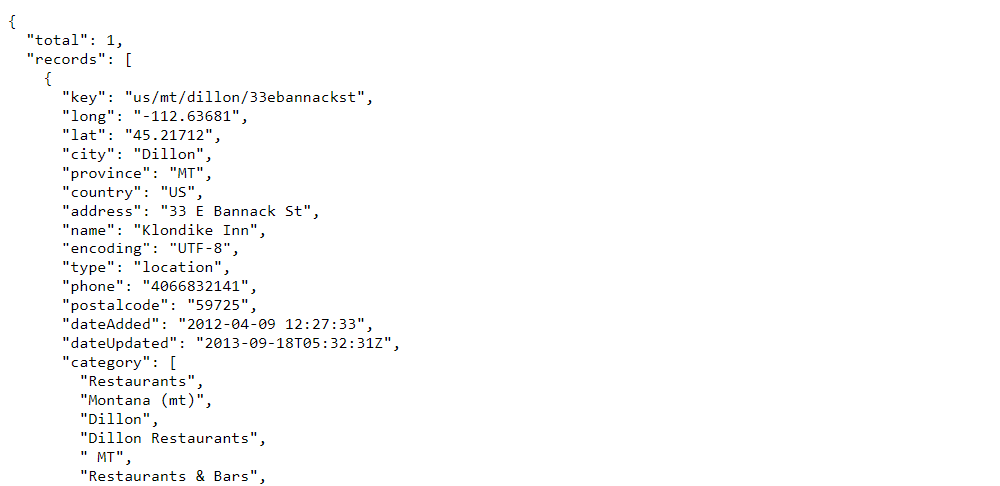
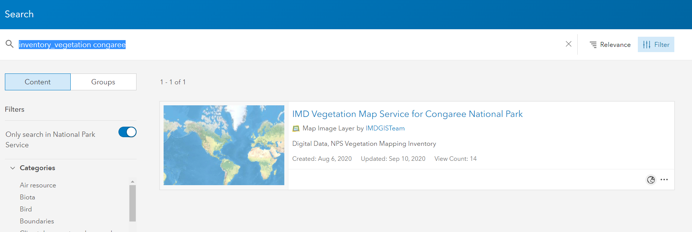
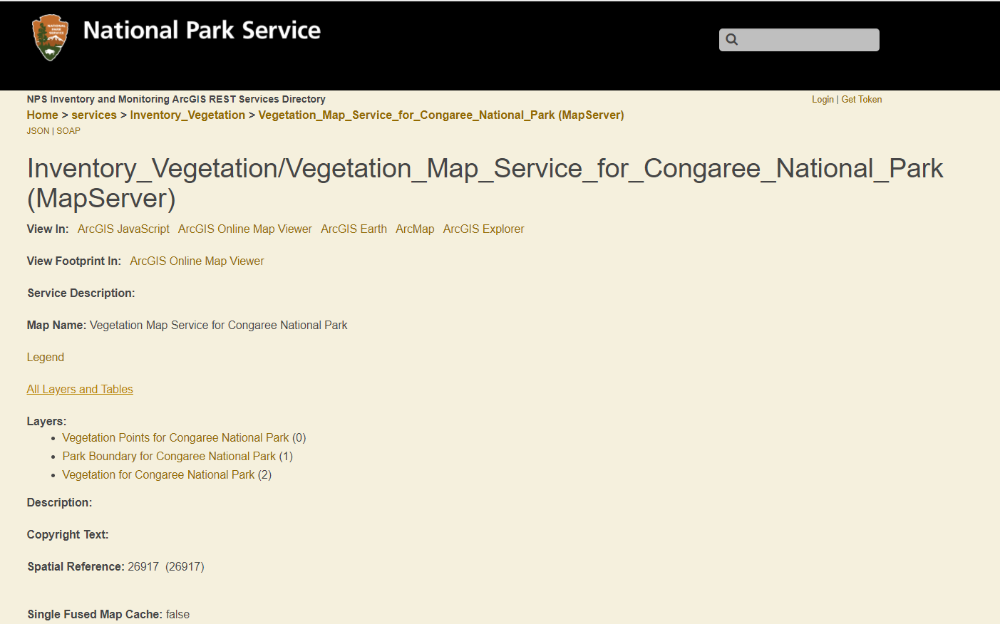

#### Reading in Web-Based Data, Part 2 {.tabset}

<details open><summary class='drop'>Packages Used in this Section</summary>
```{r, echo = TRUE, results = FALSE, message = FALSE, warning = FALSE}

# Packages used in this section
pkgs <- c("tidyverse",
          "jsonlite",
          "httr",
          "geojsonsf")

installed_pkgs <- pkgs %in% installed.packages() # check which packages are not yet installed
if (length(pkgs[!installed_pkgs]) > 0) install.packages(pkgs[!installed_pkgs],dep=TRUE) # if some packages are not yet installed, go ahead and install them...
lapply(pkgs, library, character.only = TRUE) # ...then load all the packages and their dependencies
```
</details>
<br>
<details open><summary class='drop'>Working with Web-Based Data in `R`, Part 2</summary>

This section focuses on parsing JSON and GeoJSON data formats obtained from RESTful web services.

</details>
<br>
<details open><summary class='drop'>What are RESTful Web Services?</summary>
Sometimes, the data we want to pull from the Internet may not be available as a simple .csv or compressed file accessible with a click on a hyperlink or download button. Many agencies and other "data keepers" make their data available via APIs (Application Programming Interfaces) over the internet, i.e., through a web service. APIs define how requests for information (data, images, etc.) should be made from a "client" (e.g., `R` running from our computer) to a "server", and how the server will then respond--hopefully with the requested information! 

REST (Representational State Transfer) is a type of web service that is popular for data exchange because it is lightweight (fast), human readable, and relatively easy to build. Pulling data from a RESTful web service requires a URL, which is the API "endpoint" that tells the web service what data we are requesting. 

Typically when we ping a data request to a server we are asking for just a subset of the data available that the web service offers. For example, we may want monthly precipitation total from a particular weather station for a specific range of years. Therefore, our data request (via the URL) will include query parameters that specify the subset of data we want (similar to using `dplyr::filter()` to subset data).

Some RESTful web services also require an API password, username, and/or token (to authenticate the request). This additional information will also be incorporated in the URL. 

The Internet is chock-full of information on API's and web services, and REST architecture. Some good starting points are [here](https://nordicapis.com/web-service-what-is-a-rest-api-and-how-does-it-work/) and [here](https://www.redhat.com/en/topics/api/what-is-a-rest-api).

</details>
<br>
<details open><summary class='drop'>What are JSON and GeoJSON Data Formats?</summary>

JSON (Java Script Object Notation) is a highly scalable, human-readable, language-independent data format commonly used for storing and exchanging data via web services. JSON data are written as key/value pairs, e.g., "name":"Sebastian". Curly braces `{}` and square brackets `[]` are used to structure the data in a way that allows hierarchical/relational data structures (as we would see in a database with linked tables) to be clearly represented in a text file. Here is an example of JSON formatted data.



GeoJSON is a data format written in JSON, but following a specific standard for encoding geographic data structures such as points, lines, and polygons. We can think of GeoJSON data format as a JSON format with additional rules specific to how geographic data should be represented. 

</details>
<br>
<details open><summary class='drop'>Can Geographic Data in JSON Format Be Converted to Spatial Objects in `R`?</summary>

Geographic data provided in JSON format can still (potentially) be used for mapping in `R`, just as .csv files with latitude and longitude data columns can be used to create point maps. If the geographic data structures are more than just points with x/y coordinates, it may take quite a bit of coding to parse the JSON object and reorganize the data so the object can be used for mapping.

</details>
<br>
<details open><summary class='drop'>Examples of Web Services for Natural Resources Data</summary>

The National Park Service provides geographic data via web services as described [on this page](https://www.nps.gov/subjects/gisandmapping/tools-and-data.htm).

NOAA developed and maintains the [Applied Climate Information System web service](http://www.rcc-acis.org/), which compiles and summarizes climate data for public use. The datasets are described [here](http://www.rcc-acis.org/docs_datasets.html) and the RESTful web service query builder is [here]
(http://builder.rcc-acis.org/). 

USGS water quality data can be obtained through the Water Quality Portal (a RESTful web service), as described [here](https://www.waterqualitydata.us/webservices_documentation/). Even though the USGS `dataRetrieval` package has functions to query and download data from the Water Quality Portal, the functions may not be able to accommodate complex queries. In that case we can always write code to query the web service directly. 

These are just three examples. Once you learn how to import and work with data from RESTful web services, a whole new world of data will be at your fingertips.

</details>
<br>
<details open><summary class='drop'>`R` Packages for Accessing Data from RESTful Web Services</summary>

Before scripting code to pull data from a RESTful web service, it may be useful to see if an `R` package has already been created as a wrapper for accessing data from the web service. For example, USGS has created an `R` package called `dataRetrieval` that has functions for querying and downloading data from its water quality web services. The site [ropensci](https://ropensci.org/) is a great source for finding `R` packages that make it easier to query, import, and work with publicly available scientific data (typically via web services). Many of the best-known citizen science projects have created `R` packages that are API wrappers. For example:

-	eBird has the package [`auk`](https://cornelllabofornithology.github.io/auk/)
-	iNaturalist has the [`rinat`](https://docs.ropensci.org/rinat/) package
-	gbif has the package [`rgbif`](https://docs.ropensci.org/rgbif/articles/rgbif.html)

</details>
<br>
<details open><summary class='drop'>Let's Get Started</summary>

In these examples we will read in National Park Service inventory data that are publicly available from ArcGIS REST services. While our examples focus on NPS data, the code can be modified to get data from other RESTful web services. 

**These examples are intended only to GET YOU STARTED** with retrieving JSON and GeoJSON formatted data from web services. There is SO much more to learn than we what cover here.

To begin, we need to find the ArcGIS REST endpoint for a park's vegetation inventory data.

1. Go to `https://nps.maps.arcgis.com/home/index.html` (these are publicly available data).

2. Click on the search icon (magnifying glass) in the top right corner. In the search bar, type `inventory_vegetation` and a park name or 4-letter code, e.g., `inventory_vegetation cong`. (NOTE that `inventory_geology` will give the corresponding maps with geology data). You should see a page like this:


3. Click on the map service hyperlink. In the image above, the hyperlink is the blue texted "IMD Vegetation Map Service for Congaree National Park".

4. You can select "Open in Map Viewer" to see what the available GIS layers look like. To find the URL for a particular GIS layer, click on the hyperlink under `Layers`. You should then see a page that looks like this:


From here, the steps differ slightly for each example below

</details>
<br>
<details open><summary class='drop'>Reading in JSON data from ArcGIS REST services</summary>

<details open><summary class='drop2'>Example 1. Providing the full URL with embedded query</summary>

In this example we will enter data query parameters on the web page, then generate (GET) the full URL with embedded query. This URL will be used to download the requested data in JSON format. The data represent geographical points so should be downloaded in GeoJSON format. But we will request the data in JSON format to show you how to then convert the data to a list of data frames.

Proceeding from Step 4...
5. Under `Layers`, click on `Vegetation Points for Congaree National Park`. This is a map layer that includes vegetation plot and observation points for the park.

6. This page shows useful information about the supported query formats (JSON, AMF, geoJSON), mapped vegetation categories, map projection (ESPG 26917) and map extent (boundary box). At the bottom of the page you should see a list of data fields in the data set. Click on the `Query` hyperlink.

7. On the blue query page (shown below), enter `1=1` (no backticks) for **Where:**. This means we are not applying any filters to subset the data. Enter `*` (no back ticks) for **Out Fields:**. This means we want all data fields to be included. For **Format:**, select `JSON`. 


8. Press the `Query(GET)` button at the bottom on the query page. 

You should now see a webpage with the requested data in JSON format. Copy the URL for this page and enter it in your `R` script. Save it to a variable named `file_loc`, then proceed with the following code.

```{r, echo = FALSE, eval = FALSE, warning = FALSE, message = FALSE}
file_loc <- "https://irmaservices.nps.gov/arcgis/rest/services/Inventory_Vegetation/Vegetation_Map_Service_for_Congaree_National_Park/MapServer/0/query?where=1%3D1&text=&objectIds=&time=&geometry=&geometryType=esriGeometryEnvelope&inSR=&spatialRel=esriSpatialRelIntersects&relationParam=&outFields=*&returnGeometry=true&returnTrueCurves=false&maxAllowableOffset=&geometryPrecision=&outSR=&having=&returnIdsOnly=false&returnCountOnly=false&orderByFields=&groupByFieldsForStatistics=&outStatistics=&returnZ=false&returnM=false&gdbVersion=&historicMoment=&returnDistinctValues=false&resultOffset=&resultRecordCount=&queryByDistance=&returnExtentOnly=false&datumTransformation=&parameterValues=&rangeValues=&quantizationParameters=&f=pjson&as_sfid=AAAAAAWwtYnFdzPLPheHpat-uOHUIjWYRGZh1ZaXYD2RdBDHkpArwB4pw8I0LXyeNO_mXEswL3qFD4pqVVs5R0aNDyWfurVajSmWIy6LmPCCtyKAaIa7Mw-jSTHAfioayEJ-k8k%3D&as_fid=ad543cb412004eb497caa336d36757253f442b06"
```

```{r, echo = TRUE, eval = FALSE, warning = FALSE, message = FALSE}
# NOTE: 
# 1. The `jsonlite::fromJSON` function converts objects from JSON format to another `R` object such as a data frame.
# 2. The `jsonlite::fromJSON` function can take a JSON string, URL or file as its first argument. However, we will download the data to a temporary file, THEN apply the `jsonlite::fromJSON` function. 
# 3. Since the data represent geographic points and we want to use the data for mapping, we have one more step to do. The function`sf::st_as_sf()` converts the specified data frame to a simple feature (similar to a shapefile) for mapping. Because we downloaded data in JSON format instead of GeoJSON, we have to explicitly specify the columns that hold the x and y coordinate data, and we have to specify the CRS.

tmp <- tempfile()
download.file(file_loc, tmp) # the data are still in JSON format

veg_pts_df <- jsonlite::fromJSON(tmp) 
# View(df) 
# `df` is a list of data frames. 

veg_pts_sf = sf::st_as_sf(veg_pts_df$features$geometry,  coords = c("x", "y"), crs = 26917) 
plot(veg_pts_sf)
```

</details>
<br>
<details open><summary class='drop2'>Example 2. Using `httr` functions to build the full URL</summary>

In this example we will use `httr` functions to build the full URL that will be used to download the requested data in JSON format. After that, the remaining steps will be the same as in Example 1. Building the full URL in `R` is more reproducible and transparent than generating the full URL from a web service query tool. 

For web services that require client authentication through usernames, passwords, API tokens, etc., the sensitive information should be saved in and then sourced from an [.Renviron file](filehttps://www.roelpeters.be/what-is-the-renviron-file/) rather than hard coded into the script that imports the data.

Proceeding from Step 4...

5. Under `Layers`, click on `Vegetation Points for Congaree National Park`. 

Copy the URL for the resulting page and enter it in your `R` script. Save it to a variable named `base_url` as shown below, then proceed with the rest of the code.

```{r, echo = TRUE, eval = FALSE, warning = FALSE, message = FALSE}
base_url <- httr::parse_url("https://irmaservices.nps.gov/arcgis/rest/services/Inventory_Vegetation/Vegetation_Map_Service_for_Congaree_National_Park/MapServer/0")

base_url$path <- paste(base_url$path, "query", sep = "/")

base_url$query <- list(where = "1=1", # code in the query parameters
                  outFields = "*",
                  f = "json")
request <- httr::build_url(base_url) # compare this URL to the one we used in Example 1

# Everything from here down is the same as in Example 1, but full URL is in `request`
tmp <- tempfile()
download.file(request, tmp)

veg_pts_df <- jsonlite::fromJSON(tmp) 
veg_pts_sf = sf::st_as_sf(veg_pts_df$features$attributes,  coords = c("x" = "X_Coord", "y" = "Y_Coord"), crs = 26917)
# View(veg_pts_sf)

plot(veg_pts_sf["Pnts_Type"], main = "Congaree National Park Vegetation Points")
```
</details>
</details>
<br>
<details open><summary class='drop'>Reading in GeoJSON data from ArcGIS REST services</summary>

We will now download inventory vegetation data in GeoJSON format, then use the `geojsonsf::geojson_sf()` function to convert the object to an `sf` object. As stated in `?geojson_sf`, "Geojson specification RFC7946 says all CRS should be the World Geodetic System 1984 (WGS 84) [WGS84] datum, with longitude and latitude units of decimal degrees. This is equivalent to the coordinate reference system identified by the Open Geospatial Consortium (OGC) URN urn:ogc:def:crs:OGC::CRS84". In other words, regardless of the coordinate reference system of the GeoJSON object, the final `sf` object will have CRS of WGS 84.

We will use `httr` functions to build the full URL, but as in Example 1 we could also just use the ArcGIS query builder to generate the full URL.

```{r, echo = TRUE, eval = FALSE, warning = FALSE, message = FALSE}

base_url <- httr::parse_url("https://irmaservices.nps.gov/arcgis/rest/services/Inventory_Vegetation/Vegetation_Map_Service_for_Congaree_National_Park/MapServer/2") # note that the vegetation layer is MapServer/2

base_url$path <- paste(base_url$path, "query", sep = "/")

base_url$query <- list(where = "1=1", # code in the query parameters
                  outFields = "*",
                  f = "geojson")
request <- httr::build_url(base_url) # compare this URL to the one we used in Example 1

tmp <- tempfile()
download.file(request, tmp)

# Because the data are in GeoJSON format we will use `geojsonsf::geojson_sf()` to convert the object to an `sf` object
geo_sf <- geojsonsf::geojson_sf(tmp)
# View(geo_sf)

plot(geo_sf["MapUnit_Name"], main = "Congaree National Park Vegetation Types") # quick plot using base R - clearly issues with an unreadable legend, so needs tweaking. Also remember this `sf` has a different CRS than does `veg_pts_sf` so one would have to be transformed before both layers could be mapped together
```
</details>