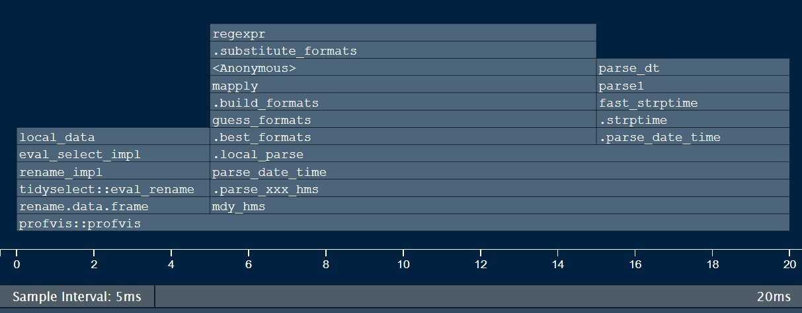

#### Tips and Tricks
  
<details open><summary class='drop'> Commenting</summary>

Adding comments to your code can help future users, including future you, understand what 
the code does and why you did it. However, comments are more work and too many comments can clutter your 
code with unhelpful information. Also, as you update and improve your code you should update relevant 
comments as well. The more comments you have the easier it is for your comments and code to get out of sink.  
  
Some things to consider:  

  1) Try to give functions and things created inside of functions names that indicate what they do / are.   
  
  2) Don't explain every line. If you code is that hard to follow, then there is a problem with your code. 

  3) If you use functions from packages (e.g. `tidyverse` functions), you don't need repeat basic info from the help.

  4) If your function has different sections that do different things - e.g. prepare data and then use data - it can be helpful to use comments to distinguish each section and explain what it does.  
  
  5) If you need to do something unusual to account for missing data, special cases, bugs in other people's code - add comments to explain what you are doing.  
  
  6) If there was some obvious way to do something but you could not use it for some reason, indicate why.  
    
  7) If you are using what seems to you to be an obscure package - note why you are using it. 
  
  8) If you have a close curly brace or close parenthesis that is many many lines form the where the opening brace / parenthesis is, it can be helpful to indicate what it is closing. 


</details>


<details open><summary class='drop'>Performance - Introduction</summary>

"Performance" here refers to how fast your code does something.

Faster is generally better, but it often requires more time to write and can include code that is harder to read.

Most of the time you cna ignore performance. If you run the code and are happy with how long it takes, then there is no problem.

Performance can be a consideration when:

  1) You are doing the same analysis many (dozens to hundreds) of times. Think of an analysis of each species at many parks, or each water quality measure at many sites.  
    
  2). If you have very large data files that you need to manipulate.  
    
  3). If you are doing a simulation study and need to create and manipulate large numbers of data sets. 
    
  4). If you are doing some sort of interactive visualization and need results very quickly. 
  
</details>

<br>

<details open><summary class='drop'> Vectorization </summary>
R has "vectorization" - this means there are some functions that take a vector as an input, perform a calculation or operation on each element and return a vector as output. Some examples:

Numeric Vector
```{r num_vector}
# A vector of numbers
x <- 1:10

# Arithmetic is vectorized
x + 1
```

Character Vector
```{r character_vector}
# a character vector (letters)

x <- letters[1:10]

# paste is vectorized
paste("Letter:", x)

```

Logical Vector
```{r logical_vector}
# a logical vector

x <- c(TRUE, TRUE, FALSE, TRUE, FALSE, FALSE)

# logical operations are vectorized

TRUE & x

```

Date Vector
```{r date_vector}
# a date vector

library(lubridate)

x <- mdy("02/07/2022", "02/08/2022", "02/09/2022", "02/10/2022")
x
```


```{r date_vector_add}
## adding 1 shows you the next day
x + 1

rm(x)

```

Most functions in R are vectorized. This includes:

1) Mathematical functions, including statistical functions.  
  
2) Logical operators.  
  
3) Functions such as `rowMeans()` that work on matrices.  
  
4) Text manipulation functions.  
  
Many of these functions are written in C which makes them extremely fast. 

You SHOULD NOT write a function or a `for()` loop to do iteration when the pre-existing vectorization will do the same thing.

You SHOULD make use of vectorization in your functions to keep them fast and readable.

When you use the `dplyr` function `mutate()` you are making use of vectorization. 

</details>


<details open><summary class='drop'>Profiling</summary>

"Profiling" is looking at each part of a function to find out how long it takes. This can allow you to identify bottlenecks where speeding up your code might be helpful. Then tools such as `microbenchmark` can be used to compare options. RStudio has profiling tools built in but to use then you need to install the `profivs` package.

Once you do this you can access the Profile menu in the top menu bar. You can select some code, and use "Profile Selected Line(s)" to run the profiler.


This will give you a "Flame Graph" which tells you how much time each part of your function was running. Here we will profile the `Fix_Data()` funciton from earlier. 



The graph shows time across the bottom. Looking from the bottom to the top you see how long various parts took. You can see that `profvis` (the profile tool) in the bottom row was running the whole time. One row up is `mdy_hms()` from `lubridate` which takes up most of the time. You don't see functions like `select()` or `rename()` as they ran too quickly. So if you wanted to speed up `Fix_Data()` the place to look for improvements is in the date conversion. 
</details>


<details open><summary class='drop'> Benchmarking </summary>

Let's say that you wanted to speed up the `Fix_Data()` function. Benchmarking is a tool you can uses to compare different versions of a function to see which one runs faster. To do this we will use the `microbenchmark` package. Earlier the `as.POSIXct()` function was used to convert the `DateTime` columns from `character` to `date`. Lets see if that is quicker. We will also try the base function `strptime`.


```{r purr benchmark}
library(tidyverse)
library(lubridate)
library(microbenchmark)

# Recreate intensity data
fNames <- c(
  "APIS01_20548905_2021_temp.csv",
  "APIS02_20549198_2021_temp.csv",
  "APIS03_20557246_2021_temp.csv",
  "APIS04_20597702_2021_temp.csv",
  "APIS05_20597703_2021_temp.csv"
)

fPaths <- paste0("https://raw.githubusercontent.com/KateMMiller/IMD_R_Training_Intro/master/Data/", fNames)

intensity_data_raw <- set_names(fPaths, c("APIS01", "APIS02", "APIS03", "APIS04", "APIS05")) %>%
  map(~ read_csv(file = .x, , skip = 1)) %>%
  discard(~ nrow(.x) == 0)


# Original function
Fix_Data_Lubridate <- function(data) {
  data %>%
    select(starts_with("Date") | starts_with("Temp") | starts_with("Intensity")) %>%
    rename("Date_Time" = starts_with("Date"), "Temp_F" = starts_with("Temp"), "Intensity" = starts_with("Intensity")) %>%
    mutate(Temp_C = 5 * (Temp_F - 32) / 9, Date_Time = mdy_hms(Date_Time), Date = date(Date_Time))
}


# New version using as.POSIXct()
Fix_Data_POSIXct <- function(data) {
  data %>%
    select(starts_with("Date") | starts_with("Temp") | starts_with("Intensity")) %>%
    rename("Date_Time" = starts_with("Date"), "Temp_F" = starts_with("Temp"), "Intensity" = starts_with("Intensity")) %>%
    mutate(
      Temp_C = 5 * (Temp_F - 32) / 9, Date_Time = as.POSIXct(Date_Time, "%m/%d/%y %H:%M:%S", tz = "UCT"),
      Date = date(Date_Time)
    )
}

# new version using strptime
Fix_Data_strptime <- function(data) {
  data %>%
    select(starts_with("Date") | starts_with("Temp") | starts_with("Intensity")) %>%
    rename("Date_Time" = starts_with("Date"), "Temp_F" = starts_with("Temp"), "Intensity" = starts_with("Intensity")) %>%
    mutate(
      Temp_C = 5 * (Temp_F - 32) / 9, Date_Time = strptime(Date_Time, "%m/%d/%y %H:%M:%S", tz = "UCT"),
      Date = date(Date_Time)
    )
}

# Do Comparison
mb<-microbenchmark(
   Lubridate = intensity_data_raw %>% map(~ Fix_Data_Lubridate(.x)),
   POSIXct = intensity_data_raw %>% map(~ Fix_Data_POSIXct(.x)),
   Strptime = intensity_data_raw %>% map(~ Fix_Data_strptime(.x)),
  times = 10L, unit = "ms"
)

mb

boxplot(mb)
```


As it happens, the `lubridate` version came out the fastest. You should also consider if this data is representative of the work you need to do. It is not unusual for one way of coding to be fastest with large amounts of data, but not have an advantage for small amounts of data. 


</details>
