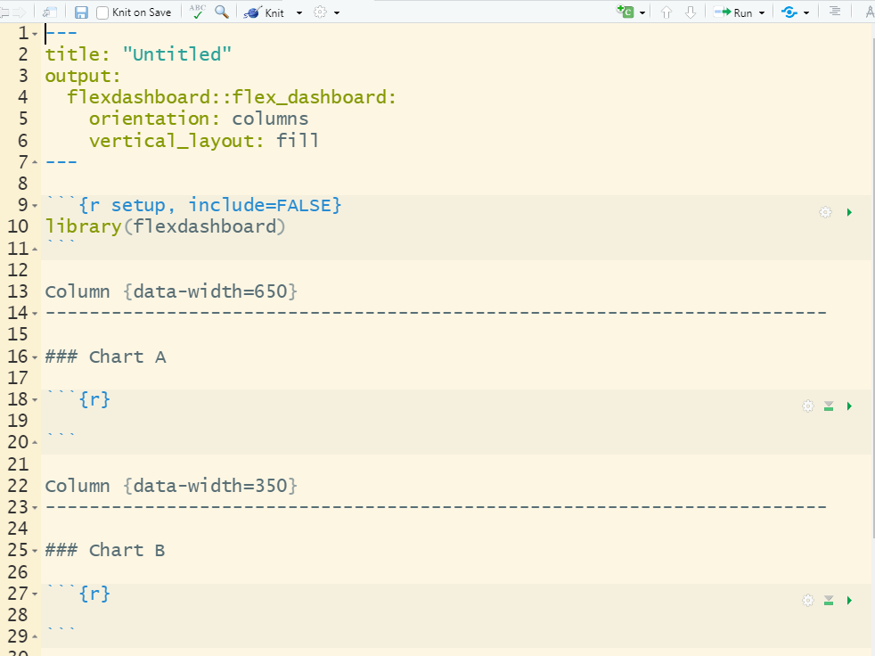
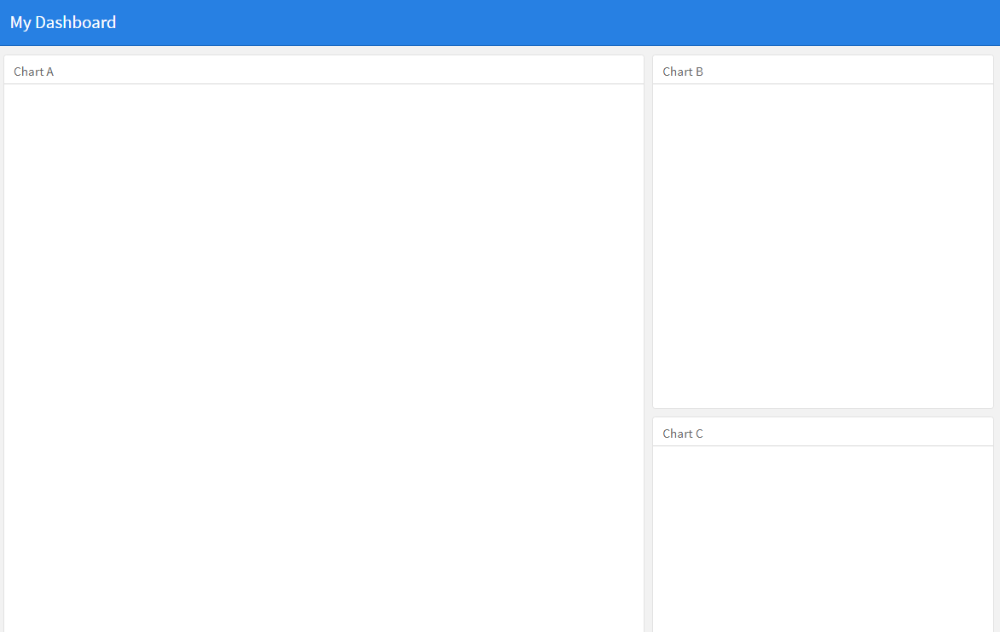
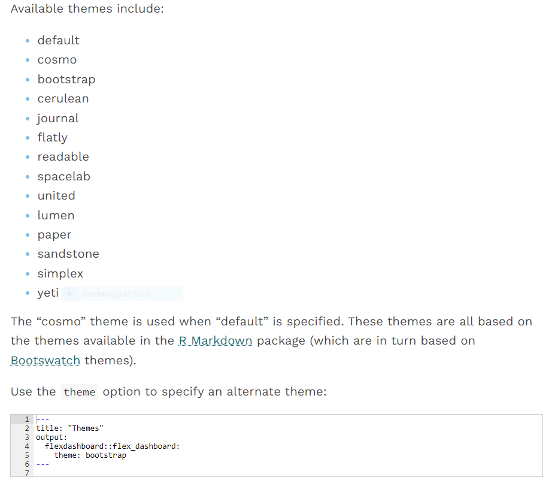
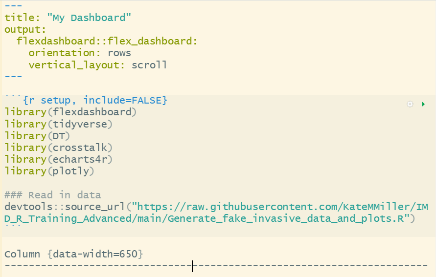
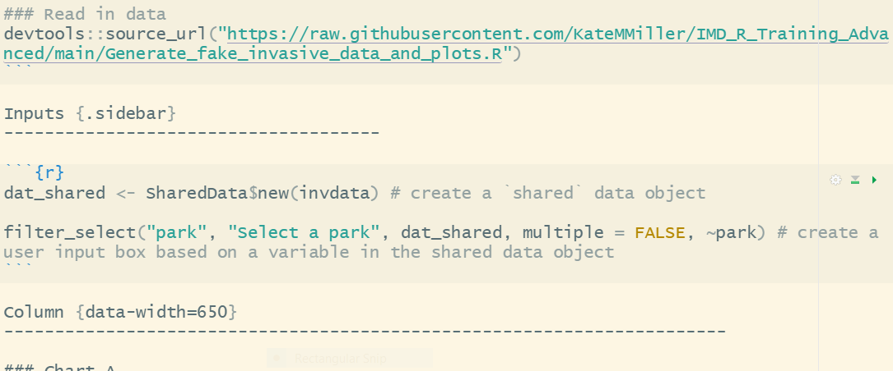
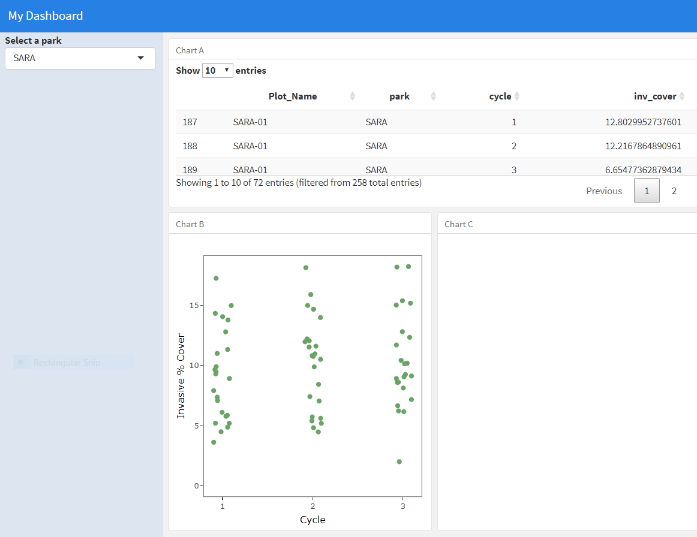
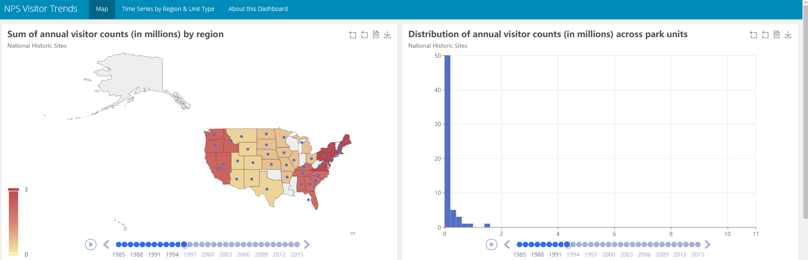

#### Interactive RMarkdown {.tabset}

<details open><summary class='drop'>Packages Used in this Section</summary>
```{r, echo = TRUE, results = FALSE, message = FALSE, warning = FALSE}

# Packages used in this section
pkgs <- c("tidyverse",
          "flexdashboard",
          "crosstalk",
          "scales",
          "DT",
          "echarts4r",
          "echarts4r.maps", # used for demo, not needed by participants
          "reactable",
          "plotly",
          "sparkline")

installed_pkgs <- pkgs %in% installed.packages()
if (length(pkgs[!installed_pkgs]) > 0) install.packages(pkgs[!installed_pkgs],dep=TRUE) 
lapply(pkgs, library, character.only = TRUE)
```

In this section we will get you started with using R markdown to build an interactive dashboard. We will use R markdown's flex dashboard template to build this dashboard because: 

1. It is easier than creating a dashboard with R Shiny.

2. It is not R Shiny.

If you don't understand why that second point is important, it's okay. What IS important is that we will be using html widgets to make our dashboard interactive. When we "knit" the dashboard we will generate an interactive HTML file that can be used by anyone with access to a web browser. The lucky recipient of the dashboard will not need R knowledge or R software. The dashboard--a simple html file--will not be able to run statistical analyses or do any kind of calculations on-the-fly, but it will be able to sort and filter data and generate tables and plots based on user-selected subsets of data. This feature of a simple html dashboard can be useful when we have large data sets and don't want to flip through 100 pages of plots to find the one we are looking for. 

</details>
<br>
<details open><summary class='drop'>Flex Dashboard</summary>

Reading about building a dashboard isn't particularly useful, so we will just jump in and sink or swim. We're going to open a new flex dashboard template, practice doing a few different dashboard layouts, then use the fake invasive data and plots to make a dashboard together.

To open a new flex dashboard template:

1. In RStudio, go to `File` > `New File` > `R Markdown`... [click]
2. When the pop-up appears, go to `From Template` > `Flex Dashboard` [click on it and then click the `OK` button]

You should see something like this show up on your RStudio script pane.



3. This template currently has the title "Untitled". Replace that text with a more exciting name for your first flex dashboard.
4. Now 'knit' the file -- that is, click the blue yarn icon at the top of the flex dashboard template. You will be asked to save the file, so put it somewhere you can find it.

You should see something like this.



If you look at the pre-populated code in your template and compare that to the html dashboard that resulted from knitting the file, you should start to get a feel for what the lines and hashmarks mean on the template.

Now make each of these changes and see what each one does:

- Change the vertical layout from "fill" to "scroll"... then knit to see

- Change the orientation from "columns" to "rows"... then knit to see

- Look on [this page](https://pkgs.rstudio.com/flexdashboard/articles/layouts.html) to figure out how:
  
  - add another page to your dashboard
  - add a tabset to one of your pages
  - add an input sidebar on the first page on your dashboard << go ahead and do this one, we will want it for our user input boxes

- Just like `ggplot2` has themes to choose from, so does flex dashboard. Choose from one of options below and change your dashboard theme (the image below the list shows you where to type it on your dashboard--heed the indention!)




That's really all you need to know to get started on a simple dashboard. 

</details>
<br>
<details open><summary class='drop'>DT::Import Data and Load Packages</summary>

Now we're going to load data and use some html widgets (just think of them like `R` packages) to put an interactive table and two plots on your dashboard. For the table we will use `DT::datatable()`. For the plots we will use the `plotly` and `echarts4r` packages. We will use the package `crosstalk` to add user input boxes that will subset the data you see in the table and in the `plotly` plot.

1. Create a new code chunk, or use the `setup` chunk provided on the dashboard template, to write the code for reading in a data set and loading the libraries we need. You can call the code chunk anything you want--there is nothing special about the name `setup`. In the example below I have read in the fake invasive plants data from the `R Markdown > Parameters` tab of the training website.



2. Run the code chunk to load the data and libraries. Make sure your global environment now shows the data you loaded.

</details>
<br>
<details open><summary class='drop'>DT::datatable</summary>

The `DT::datatable()` function is pretty easy to use and has some nice features for sorting, filtering, and displaying data tables with various themes. Just as important is the fact that it is one of the [few html widgets](https://rstudio.github.io/crosstalk/widgets.html) that is currently compatible with `crosstalk`. So when a user makes data selections via a `crosstalk` input box, `datatable()` function will update the table data to reflect the user selections. We will get the tables and plots on our dashboard, then add the `crosstalk` features last.

The [`DT` website](https://rstudio.github.io/crosstalk/widgets.html) shows us that the `datatable()` function only requires one argument -- a data object like a matrix or data frame. So:

1. In one of your dashboard "boxes" (e.g., Chart A, B, C or any additional boxes you created on your own), add the code line to create a `datatable`. Make sure you put the code inside a code chunk, so `R` recognizes it as code to execute. Don't filter a subset of the data before you pass it to `datatable()` -- we will be creating user input boxes to filter the data based on user request.

2. Then run that one chunk to make sure your code works. To run a single chunk, click the green "sideways" triangle at the top right corner of the chunk. When you hover over it, you should see "Run code chunk". You should see a table appear below the chunk (assuming you're on the default flex dashboard setting of "Chunk Output Inline"--you can change this option by clicking on the gear wheel, if you would like).

To get the image below, I read the `invdata` data frame into `datatable()`.


At some point you can return to this table do some numbers rounding, change column names, or do any kind of formatting you would like. You will learn, in fact, that it's quite simple to generate a basic dashboard. Formatting the dashboard is what will take up at least 90% of your dashboarding time (unless you don't care how good it looks).

As a side note, I really like the `reactable` package for making nested collapsing tables with informative icons and interactivity with plots (e.g., you can select a record on a table and it will highlight the corresponding point on a scatter plot). It takes a bit of time to learn but it's worth checking out.

</details>
<br>
<details open><summary class='drop'>Plotly</summary>

In another dashboard "box", use `plotly` to build a plot with the same data frame you passed to `datatable()`. Again, don't filter out a subset of the data--just pass the entire data frame to the plot function. For starters, the easiest way to do this is:

1. Use `ggplot()` to make a plot from the data frame you passed to `datatable()`. Assign that plot to a variable name. Then on the next line (after the plot code), pass your plot to the `ggplotly()` function. So for example, you could write something like:
`p <- ggplot(some_dataframe, aes(x = cycle, y = inv_cover)) + geom_point()`
`ggplotly(p)`

2. Run that code chunk. You should see an interactive version of your ggplot. The plot will look a little different when it comes out of `ggplotly()`--that's an example of the potential formatting issues I mentioned.

</details>
<br>
<details open><summary class='drop'>Crosstalk</summary>

As of now, the [`crosstalk`](https://rstudio.github.io/crosstalk/using.html) package--which is pretty new--has three functions that can be used to filter the data based on user input. These functions are: 

- `filter_select()`, which creates a text box with drop-down menu
- `filter_slider()`, which creates a two-sided slder that can be used to specify a range of data
- `filter_checkbox(), which creates a check box for each level of a specified categorical variable.

All of these filter functions subset the data in the same way that `dplyr::filter()` works.

Before adding filter functions to our dashboard, we need to create a `SharedData` object, which just means we need to wrap a data frame in the `SharedData$new()` function. This data frame is the one that will be queried by the filter functions, and the resulting (subset) of data will be used by `crosstalk`-compatible html widgets to update their plots and tables. On our current dashboard, the `DT` and `plotly` objects are `crosstalk`-compatible. It's possible to create different sets of filter functions to work on different data frames and compatible widgets, all on the same dashboard. The `crosstalk` website has examples.

Follow the steps below to add a `crosstalk` filter to your dashboard. 

1. Create a new code chunk within your dashboard's input sidebar (remember that was one of the earlier practice tasks?)? You can name your code chunk, but it's not necessary. 

2. In the code chunk, write code to pass a data frame to the `SharedData$new()` function and assign the output to a variable name. You should be using the same data frame you has passed to `DT::datatable()` and `ggplotly()`. For example:

`dat_shared <- SharedData$new(invdata)`

3. On the next line of that same code chunk, write code to create a filter function. For example:

`filter_select(id = "park", label = "Select a park", sharedData = dat_shared, ~park)`
In the example above I've created a selection filter that I've named "park" (any unique ID is fine). I have written a label to prompt the user to select a park. I've told the function the name of the shared data frame to operate on. And lastly, I've identified the column in that data frame that the filtering will act on.

All together, the code chunk should look something like this:



4. Now pass the shared data frame to your `DT::datatable()` and `ggplotly()` functions (i.e., replace the old data frame name with the name of the shared data frame). We are telling these two functions to use the SHARED data frame to populate the table/plot. 

5. Knit your dashboard to see if everything is working so far. You should see a user input box (or slider or checkbox, depending on what you chose) in the user sidebar on the left side of the dashboard. When you make a selection in that box you should see your table and plot update.



</details>
<br>
<details open><summary class='drop'>Last Plot</summary>

This one is up to you. You can create a different kind of `plotly()` figure (based on the same shared data frame) to put on your dashboard. OR you can try out one of these very cool [`echarts4r`](https://echarts4r.john-coene.com/articles/get_started.html) plots with your data. Note that in the examples, they use `|>` to pipe their functions instead of `%>%`. Either one will work. Also note that `echarts4r` is not yet compatible with `crosstalk`. But that's no reason to not use a widget on your dashboard. Interactive plots and tables can be useful even if they don't interact with `crosstalk` shared data frames. 

Here is an example of an interactive map and histogram I made with `echarts4r` functions.


[This page](https://www.htmlwidgets.org/showcase_leaflet.html) has links to many other really nice html widgets that you can use on your R markdown dashboards. Check them out!