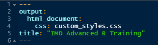

#### Intro to R Markdown {.tabset}
<details open><summary class='drop'>Background</summary>
R Markdown is a special file format that you can open in RStudio (go to File > New File, and "R Markdown..." is the 3rd option). R Markdown takes what you put into the .Rmd file, knits the pieces together, and renders it into the format you specified using PanDoc, which is typically installed as part of the RStudio IDE bundle. The knit and render steps generally occur at the same time, and the terms are often used interchangeably. For example, the Knit button () knits and renders the .Rmd to your output file. The knit shortcut is also super handy, which is Ctrl + Shift + K. 

The most commonly used outputs are HTML, PDF, and Word. Each output format has pros and cons, and drives which text editing language (e.g., HTML or LaTeX) you need to use for advanced/custom needs. We'll cover these in more detail in a minute.
</details>
<br>
<details open><summary class='drop'>Reasons to use R Markdown</summary>
We're all busy and it's hard to keep up on everything we need to know to do our jobs well. We wouldn't be promoting R Markdown like we are, if we didn't feel that it was a huge contributor to our efficiency and productivity. R Markdown has been described as the Swiss Army knife of Data Science, because there are so many things you can do with it. Below are just a few of the many reasons we use R Markdown.
<ul>
<li>My favorite part of R Markdown is that it's one stop shopping to store code, text/notes, results, etc., as I'm working on an analysis and writing a report. It saves me the hassle of copying and pasting figures and tables from an analysis into Word or PowerPoint, and allows me to write notes as I'm analyzing. These notes often end up going right into the Methods and Results sections my papers.</li>
<li>They're reproducible and easily updated. If the data changes, or you realize there's an error in your analysis, all you have to do is fix the issue, then rerender the .Rmd to update the output file.</li>
<li>You can use parameters (e.g., park code, year, species) to iterate through and generate multiple separate reports for each unique parameter. We'll show examples of that later. </li>
<li>The learning curve is also very shallow at the outset. In about 5 minutes of playing with it, you'll get the basics of how it works. Then, as you learn more HTML/CSS or LaTeX, the sky is the limit. This website, in fact, is built from R Markdown and hosted as a GitPage for the <a href = "https://github.com/KateMMiller/IMD_R_Training_Advanced">repo that hosts the code</a>. </li>
</ul>
</details>
<br>
<details open><summary class='drop'>Getting Started</summary>
To get started, you'll need to make sure you have the `rmarkdown` package installed. The `knitr` package, which does a lot of heavy lifting, is a dependency of `rmarkdown`, so both will be installed with the line of code below.

```{r installmark, eval = F, echo = T, out.width="400px"}
install.packages("rmarkdown") 
```

Once you have `rmarkdown` installed, you should be able to go to <b>File > New File > R Markdown...</b>, and start a new .Rmd file. After selecting "R Markdown...", you will be taken to another window where you can add a title and author and choose the output format. For now, let's just use the default settings and output to HTML. You should now see an Untitled .Rmd file in your R session with some information already in the YAML and example plain text and code chunks. You can also start with a blank .Rmd, which will be more convenient once you get the hang of it. 

</details>
<br>
<br>
<hr>

#### Anatomy of an .Rmd 
<details open><summary class='drop'>YAML</summary>
The .Rmd file itself consists of 3 main pieces. There's the YAML (Yet Another Markup Language) code at the top, which is contained within `---`, like the image below. The top YAML is typically where you define features that apply to the whole document, like the output format, authors, parameters (more on that later), whether to add a table of contents, etc. The YAML below is what we're using for this website. Note that indenting is very important in YAML. The css: custom_styles.css tells Markdown that I want the styles defined in my css, rather than the default styling in Markdown. This is optional, and is here just to show a variation on the default YAML you get when starting a new .Rmd. If you don't want to use your own custom style sheet, then your YAML would just have the following in one line: `output: html_document`.

```{r yaml, echo=F, out.width = '300px', fig.align = "left", dpi=600}
#------------------
# R Markdown I
#------------------

```

- other common additions in YAML: headers/footers, table of contents, and parameters

</details>
<br>

<details open><summary class='drop'>Plain text</summary>
This is what it sounds like- it's just text. You can write anything you want outside of a code chunk, and it will render as if you're writing in a word processor, rather than as code. Although, note that special characters like % and & may need to be escaped with a `/` before the symbol, particularly if you're using LaTeX (more on that later).
You can format text using Markdown's built in functions, like those shown below. For a more detailed list of these formatting functions, check out the <a href="https://www.rstudio.com/wp-content/uploads/2015/03/rmarkdown-reference.pdf">R Markdown Cheatsheet</a>. You can also code HTML directly in R Markdown, which I actually find easier the more I get comfortable with HTML. The section below shows how to use the same common styles with R Markdown and HTML and what the output looks like.

<div class = 'boxBorder'>
<div class = 'row'>
<div class = 'column3'>
The actual text in the .Rmd:
```
# First-level header

## Second-level header

...

###### Sixth-level header

*italic* or _italic_

**bold** or __bold__

superscript^2^

endash: --

Example sentence: *Picea rubens* is the dominant species in **Acadia National Park**.

```
</div>
<div class = 'column3'>
The HTML version:
```{html, verbhtml, attr.source="style='display:inline-block;'", collapse=TRUE}
<h1>First-level header</h1>

<h2>Second-level header</h2>

...

<h6>Sixth-level header</h6>

<i>italic</i>

<b>bold</b>

superscript<sup>2</sup>

endash: &ndash;

Example sentence: <i>Picea rubens</i> is the dominant species in <b>Acadia National Park</b>.

```
</div>
<div class = 'column3'>

The text renders as:

# First-level header <br>

## Second-level header <br>

...
<p style="padding-bottom:0;padding-top:10px">

###### Sixth-level header <br>
</p>
<p style="padding-bottom:0;padding-top:10px">
*italic* or _italic_ <br>
</p>
<p style="padding-bottom:0;padding-top:10px">
**bold** or __bold__ <br>
</p>
<p style="padding-bottom:0;padding-top:4px">
superscript^2^ <br>
</p>
<p style="padding-bottom:0;padding-top:8px">
endash: -- <br>
</p>
<p style="padding-bottom:0;padding-top:6px">
Example sentence: *Picea rubens* is the dominant species in **Acadia National Park**.<br>
</p>
</div>
<br>

</div></div>
</details>
<br>

<div class="alert alert-info">
<h4>Challenge: Specifying other headers</h4>
How would you specify header level 4?
<br>
<details><summary class = 'drop2'>Answer</summary>
```{r d3rm_a1, echo = T}
#### This is how to specify header level 4, which renders as:
```
<h4>Header level 4</h4>
</details> 
</div>

<details open><summary class='drop'>Code chunks</summary>
Code chunks are also what they sound like. They're chunks of R code (can be of other coding languages too), which run like they're in an R script. They're contained within back ticks and curly brackets, like below. 

````
`r ''````{r}

```
````
<p style="color:white">
`````</p>

<h4>Code Chunk Options</h4>
You can customize the behavior and output of a code chunk using options within the `{ }`. Common chunk options are below:
<ul>
<li>`echo = TRUE` prints the code chunk to the output. `FALSE` omits the code from output. </li>
<li>`results = 'hide'` omits results of code chunk from output. `show` is the default. </li>
<li>`include = FALSE` executes the code, but omits the code and results from the output. </li>
<li>`eval = FALSE` does not execute the code chunk, but can print the code, if `echo = TRUE`.</li>
<li>`error = TRUE` allows a code chunk to fail and for the document to continue to knit.</li>
<li>`cache = TRUE` allows you to cache the output associated with that code chunk, and will only rerun that chunk if the code inside the chunk changes. Note that if the objects or data in the code chunk are changed, but the code within the chunk is still the same, the code chunk won't realize that it needs to rerun. You need to be careful about using the cache option.</li>
<li>`fig.cap = "Caption text"` allows you to add a figure caption. </li>
<li>`fig.width = 4`; `fig.height = 3` allows you set the figure size in inches. </li>
<li>`out.width = 4`; `out.height = 3` allows you set the figure or table size as a percentage of the container/page size. </li>
<li>`message = FALSE, warning = FALSE` prevent messages or warnings from chatty packages from being included in the output. </li>
</ul>
<br>
See the <a href="https://www.rstudio.com/wp-content/uploads/2015/03/rmarkdown-reference.pdf">R Markdown Cheatsheet</a> for a complete list of code chunk options.
<br>
Another trick to using code chunk options, is that they can be conditional based on the results from another code chunk. For example, I have a QC report that runs 40+ checks on a week's worth of forest data, but the report only includes checks that returned at least 1 value/error. Checks that returned nothing are omitted from the report using conditional eval. I'll show an example of that later.

<h4>Inline Code Chunks</h4>
You can also reference objects in your R session within the plain text using back ticks (i.e., \`). In the example below, I'll first calculate a mean value that I'll pretend is the average number of species on a plot. Then I'll use inline code chunks to print that number in the plain text.

First, we calculate `numspp` with echo = F. Here I'm using the `runif()` function to randomly generate 50 numbers from 0 to 100 using the uniform distribution, just to have some data to summarize. Here, the include = F will run the code chunk, but won't show the code or the results in the markdown document.

````
`r ''````{r, include = F}
numspp <- round(mean(runif(50, 0, 100)), 1)
```
````
<p style="color:white">
`````</p>

```{r, fkchunk, include = F}
numspp <- round(mean(runif(50, 0, 100)), 1)
```

To use this in a sentence, the plain text looks like this: 
```
The average number of species found in each plot was `r numspp`.
```

And renders like this: 

The average number of species found in each plot was `r numspp`.

<div class="alert alert-info">
<h4>Challenge: Code chunk options</h4>
1. How would you run a code chunk, but only show the results, not the code?
2. How would you run a code chunk, but then only include the results in the plain text?
<br>

<details><summary class = 'drop2'>Answer</summary>

Answer 1. Include in the code chunk options: `echo = F`
<br>
Answer 2. Include in the code chunk options: `include = F`, and then use inline coding with 
<br>
```
`r runif(1)`.
```

</details> 

</div>

</details>

<br>
<hr>

#### Output types
For all of the output types, the built-in markdown functions, like '#' for level 1 header, render as you expect. Most output types also have an additional code base that allows more advanced and customized features. 

<details open><summary class='drop'>Output to HTML</summary>
The code base for HTML is obviously HTML and cascading style sheets (CSS). HTML is used to structure the content. CSS is used to define the style (e.g., font type and size for each header level). 

<h3>Pros of HTML output</h3>
1. Has the fewest dependencies and least finicky of the 3 main outputs (i.e., PDF and Word).
2. You can code straight HTML and CSS in your markdown document (javascript too), so you're not limited by the built-in functions in markdown or knitr that render R code as HTML. 
3. HTML files are easy to share, and usually renders well on the most common browsers.
4. Allows you to host your files as GitPages (like this training website).
5. Relatively easy to make 508 Compliant (but don't ask me how to do it).

<h3>Cons of HTML output</h3>
1. HTML files are hard to make print friendly. Page breaks aren't an easy thing to add, and headers with a filled background (i.e., NPS banner) are hard to make print as they appear on the screen. 
2. If you share an HTML with someone, they often have to download it first and then open it in their browser. The version MS Outlook or SharePoint shows when opened within the app has less functionality than a web browser. If you have anything even slightly fancy (e.g., tabs) the view from attachments won't look the same as through a browser (or just shows you the raw HTML, which is even worse!). This means you always have to include these instructions when sharing HTML files. 
</details>
<br>
<details open><summary class='drop'>Output to PDF</summary>
Rendering to PDF requires a LaTeX engine that runs under the hood. The easiest engine to install is `tinytex`, and there are instructions and download files on the "Prep for Training" tab of this site.

<h3>Pros of PDF output</h3>
1. PDFs are a more familiar file format and easy to share (i.e., can be viewed directly in MS Outlook/SharePoint).
2. Enforcing page breaks and designing print friendly outputs is much easier than with HTML output.

<h3>Cons of PDF output</h3>
1. LaTeX is a challenging, clunky, and not overly rewarding coding language to work with. There are decent websites offering help and examples, but it's nothing like the help community and resources for HTML (or R). 
2. I'm no expert on LaTeX, so perhaps it just me. But I've spent hours fine-tuning a header in LaTeX that takes  minutes to figure out in HTML, only to have it break after updating a LaTeX package. If your output needs to be PDF, pause to think whether you REALLY need it to be PDF. If PDF is still what you want, you'll likely need to use some (or a lot of) LaTeX along the way.  
3. It's much harder to make PDFs 508 Compliant using R Markdown. The functionality just isn't there, as far as I know. PDFs have to be modified after they're rendered to be 508 Compliant, which kind of defeats the purpose of automated reporting.
4. Requires installing a LaTeX engine. MikTex is the most commonly used engine outside of R Markdown. There's a smaller implementation called `tinytex` that was developed by the same developer as the `knitr` package. To install the `tinytex` LaTeX engine, you can run the following code: 

```{r tiny, echo = T, eval = F}
install.packages('tinytex')
tinytex::install_tinytex()

#Check that it worked: 
writeLines(c(
  '\\documentclass{article}',
  '\\begin{document}', 'Hello world!', '\\end{document}'
), 'test.tex')
tinytex::pdflatex('test.tex') 
# Console should say [1] "test.pdf"

# If you ever run into issues with markdown not knitting PDF, 
# sometimes running the code below will fix the problem:
tinytex::reinstall_tinytex()

```

tinytex::reinstall_tinytex()
</details>
<br>
<details open><summary class='drop'>Output to Word</summary>
Rendering to Word can be a helpful way to generate a Results section for a report, or even the entire report for the first draft. It saves having to copy/paste figures and tables from R to Word, and makes life easier if you need to rerun your analysis or update a figure. You just update the .Rmd code and render again to Word. Admittedly I rarely use this option because the functionality is much more limited than outputting to PDF or HTML(See first Con below). See the Resources tab for links to websites and blogs that cover more detail on outputting to Word than we'll cover here.

<h3>Pros of Word output</h3>
1. It's easy to import a word document with styles as a template, and then to output your document to Word.
2. Word documents are easy to share, and may be easier to collaborate with than an .Rmd file (i.e. track changes in Word).
3. You can use a Reference Management System for bibliographies (although see bullet 3 in Cons).

<h3>Cons of Word output</h3>
1. This is the most limited output, particularly if you just use R Markdown's built-in ```output: word_document```. You really can only apply the main styles in the template you imported. Figures and tables don't always render all that well (or at all), and often need to be tweaked again in Word. Headers and footers don't render either. To do anything beyond applying main styles, you'll likely need to employ packages in the `officeverse`, including `officedown` and `flextable` packages. I've only spent a little time looking over these packages. They seem useful, but require learning another set of packages and conventions. 
2. Incorporating track changes back into R Markdown is a messy, manual process. It's not something you'd want to do repeatedly for the same paper.
3. I have yet to get a reference management system to work in Markdown. While it's possible, it may be hard to implement on government furnished equipment using approved software.
</details>
<br>

<details open><summary class='drop'>Other outputs</summary>
There are dozens of other types of output, including FlexTables/Dashboards, slide decks for presentations, and posters for scientific meetings. There are also templates for journal articles with certain journals, and even templates for building a CV or resume. RStudio's R Markdown page on <a href="https://rmarkdown.rstudio.com/lesson-9.html">Output Formats</a> includes a list with links to a bunch of other output templates. Others can be easily found and downloaded from online sources. 
</details>
<br>

<hr>