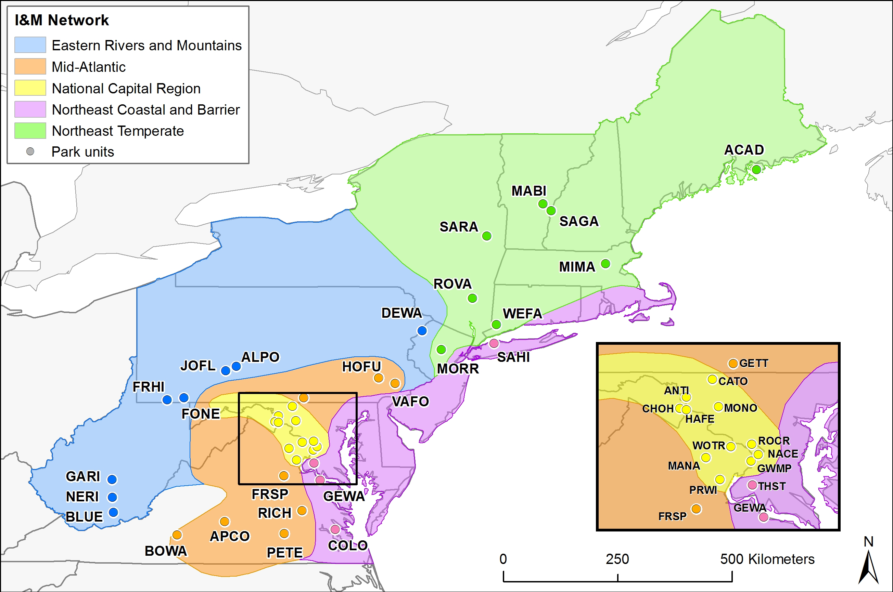

```{r setup5, include = F, echo = F}
knitr::opts_chunk$set(results = 'asis')
```

#### Tables 
<details open><summary class='drop'>Tables in R Markdown</summary>
There are quite a few packages that can help you make publication quality and customized tables. The two tables I see used most frequently are `kable()` in the `knitr` package and `datatables()` in the `DT` package (not to be confused with `data.table()` package for data wrangling in R). The learning curve for kable is pretty shallow, and runs HTML under the hood. The learning curve for DT is a bit steeper, and has javascript under the hood. That means you can customize and add more features using those languages, if you know them. I tend to stick with kable, because I find HTML/CSS easier to code. If I need more bells and whistles, then I use datatables.

First, we'll load a fake wetland dataset on our GitHub repo to make some summary tables using each package. The code below downloads the dataset from the training GitHub repo, and then summarizes the number of invasive and protected species per site. For both examples, the output format is HTML. If I were outputting to PDF, then I'd need to specify the format as 'latex' and use LaTeX code for any custom features not built into kable. 
```{r importdat, echo = T, results = 'hide', warning = FALSE, message = FALSE}
library(tidyverse)
wetdat <- read.csv(
  "https://raw.githubusercontent.com/KateMMiller/IMD_R_Training_Advanced/main/data/ACAD_wetland_data_clean.csv")
wetsum <- wetdat %>% group_by(Site_Name, Year) %>% 
  summarize(num_inv = sum(Invasive), num_prot = sum(Protected), 
            .groups = 'drop')
```

</details>

<details open><summary class='drop'>kable and kableExtra</summary>
The code below creates a simple table that renders in HTML, is only as wide as the records in the table, and has alternating row colors. If you're outputting to PDF, your format will be "latex" instead of "HTML" and you'll need to use LaTeX for any custom formatting/styling that aren't built into kable and kableExtra.

Note also that the version of kableExtra on CRAN currently has a bug that causes `collapse_rows()` not to function. I'll show what this does in a minute, but for now, just know that if you want to collapse rows in your kable, you'll need to install the development version of kableExtra on GitHub. Code for that is below. You'll need the `devtools` package installed to install it. If you've already loaded `kableExtra` in your session, you'll also need to restart your session (Note: Ctrl + Shift + F10 is the fastest way to restart your R session).
<br>
```{r kab1, echo = T, results = 'hide', warning = FALSE, message = FALSE}
devtools::install_github("haozhu233/kableExtra")
library(kableExtra) # for extra kable features
library(knitr) # for kable
wet_kable <- kable(wetsum, format = 'html') %>% # if using pdf, need LaTeX
             kable_styling(full_width = FALSE, bootstrap_options = 'striped') #kableExtra function
wet_kable
```
```{r kab2, echo = F, results = 'show', results = 'asis'}
wet_kable
```
<br>
Note the use of pipes in the code above. The great thing about kable and kableExtra is that you can pipe functions together to build out a large table with all kinds of formatting, including conditional formatting. You can also make a custom kable function that has all of the formatting options you want, and just specify the dataset to build the table for. You can then pipe more features onto that function. We'll show a couple of these examples below.
<br>
```{r kab3, echo = T, results = 'hide'}
# custom kable function that requires data, column names and caption
make_kable <- function(data, colnames = NA, caption = NA){
  kab <- kable(data, format = 'html', col.names = colnames, align = 'c', caption = caption) %>% 
      kable_styling(fixed_thead = TRUE, 
                    bootstrap_options = c('condensed', 'bordered', 'striped'), 
                    full_width = FALSE, 
                    position = 'left', 
                    font_size = 12) %>%
      row_spec(0, extra_css = "border-top: 1px solid #000000; border-bottom: 1px solid #000000;") %>% 
      row_spec(nrow(data), extra_css = 'border-bottom: 1px solid #000000;')

}

# use function with wetsum data
wetkab2 <- make_kable(wetsum, 
                      colnames = c("Site", "Year", "# Invasive", "# Protected"),
                      caption = "Table 1. Summary of wetland data") %>% 
           scroll_box(height = "250px")
```
```{r kab4, echo = F, results = 'show'}
wetkab2
```
<br>
<br>
There are a couple of new things to point out in the code: 
<ol>
<li>Because we set the arguments for colnames and caption to default to `NA`, you don't have to specify them for the function. If you don't, the column names in the table will be the names in the dataframe, and the caption will be omitted. </li>
<li>We set the columns to be centered with `align = 'c'`. If you wanted the first column to be left, and the next 3 to be centered, you would write `align = c('l', rep('c', 3))`. </li>
<li>The fixed_thead = TRUE means that if a scroll bar is added to the table, the table header (top row), will be fixed. Here we piped a scroll_box at the end of the code to show how that works. You can add a scroll box to the width of the page by adding a `width = "###px"` to the argument. Note also that if you add a scroll box, you'll want that line of code to be last. Otherwise you're likely to run into weird issues with kable that prevent the table from rendering. This is why I piped it at the end, instead of adding to the function. </li>
<li>The position = 'left' left justifies the table on the page (default is center).</li>
<li>The line starting `row_spec(0, )` adds a black border to the top and bottom of the header, which kable considers row 0. </li>
<li>The final `row_spec(nrow(data))` is adding a black border to the bottom of the table regardless of the number of rows in the table.</li>
</ol>

<br>
Finally, here are a few helpful options that render based on values in the table. Note that because we added a scroll box to wetkab2, we'll start the code over, rather than add the features via pipe to wetkab2. The scroll box always needs to be the last call in your code. If it's not you'll get a cryptic error message about `Error in UseMethod("nodeset_apply")`.
<ul>
<li><b>Conditional formatting</b> was applied to column 3 in the table (wetsum$num_inv). In the code below, the `ifelse()` that ends in FALSE is just allowing the default color to be printed instead of the conditional color. That allows the alternating row colors to remain.</li>
<li><b>Collapsing rows</b> were applied to column 1. In the rendered table you should see that Sites that are repeated in the data are merged vertically in column 1. This is a really helpful feature to make tables more digestible. Note that once you collapse a row, all pipes afterwards subtract the row you collapsed from the table dimensions, and it can be tricky to deal with. In general, it's best to have the `collapse_rows()` pipe after any `column_spec()` or `row_spec()` calls. You can also collapse on multiple columns, but it is finicky about the order of the pipes. Just use trial and error until you find the order that works. Note also that `collapse_rows()` only works in the development version of the package (see above for installation instructions).</li> 
</ul>

```{r kab5, echo = T, results = 'hide'}
wetkab3 <- make_kable(wetsum, 
                      colnames = c("Site", "Year", "# Invasive", "# Protected"),
                      caption = "Table 1. Summary of wetland data") %>% 
           row_spec(0, extra_css = "border-top: 1px solid #000000; border-bottom: 1px solid #000000;") %>% 
           column_spec(3, background = ifelse(wetsum$num_inv > 0, "orange", FALSE)) %>% 
           collapse_rows(1, valign = 'top') 
```
```{r kab6, echo = F, results = 'show'}
wetkab3
```

<div class="alert alert-info">
<h4>Challenge: Change alignment</h4>
1. Using the  `wetsum` dataframe, how would you make a table where all but the first column was center aligned, but the first column left aligned?
2. How would you make the same table be centered on the page instead of left-aligned?
<br>

<details><summary class = 'drop2'>Answer</summary>

```{r kabans, echo = T, results = 'show'}
ans_tab <- kable(wetsum, format = 'html',
                 align = c('l', 'c', 'c', 'c')) %>%  # Answer 1
           kable_styling(fixed_thead = TRUE, 
                 full_width = FALSE, 
                 position = 'left') # Answer 2 

ans_tab
```

</details> 

</div>

</details>

<details open><summary class='drop'>DT::datatables</summary>
Using the same wetsum dataset we created earlier, we'll make a table using `datatable()` and will add some of the features that `kable()` doesn't have and that usually lead me to choose datatable over kable. We'll start with a basic example and build on it.

```{r dt1, echo = T, results = 'hide'}
library(DT)
wetdt <- datatable(wetsum, colnames = c("Site", "Year", "# Invasive", "# Protected"))
wetdt
```
```{r dt2, echo = F, results = 'show'}
wetdt
```

The resulting table has several nice features that kable doesn't offer.
<ul>
<li>The search box allows you to search the records in the text </li>
<li>Each column can be sorted using the arrows to the right of each column name </li>
<li>Vertical scroll bars are added by default, and only a subset of rows are displayed. </li>
</ul>

If you want to show more or less entries in your table at a time, you can specify different values by adding options and then specifying values either for `pageLength`, or for `lengthMenu`. The `pageLength` option takes 1 value and will then display that number of entries in the table. The `lengthMenu` is similar, but also allows you to add multiple values to this list, which are then added to the dropdown menu in the Show [##] entries box. That allows the user to select the number of entries they want to see at a time.

I also added an option that stops the table from spanning the entire page.
```{r dt3, echo = T, results = 'hide'}
# modify pageLength and lengthMenu
wetdt2 <- datatable(wetsum, colnames = c("Site", "Year", "# Invasive", "# Protected"),
                    width = "40%",
                    options = list(pageLength = 10,
                                   lengthMenu = c(5, 10, 20))
                    )

```
<br>
```{r dt4, echo = F, results = 'show'}
wetdt2

```
<br>

Several additional features with datatable are shown in the code below. 
<ul>
<li>CSS can be specified in the table. Here we added a cell-border stripe, which adds vertical lines between columns the same way `bootstrap_options` added striped cells in kable.</li> 
<li>Filtering by one or more columns in the table can be really handy. This is often the reason I end up using datatable instead of kable. The code below adds a filter to the top of the columns in the table. This is a particularly useful feature if your tables have a lot of rows.</li>
<li>Allowing data to be editable is also potentially really useful. For example, you can add a blank Notes column that can then be updated and saved in the table. In the code below, I made the Notes column editable at the cell-level. Note that you have to double-click on the row to edit it. Just beware that adding notes to tables in R Markdown can cause some strange behaviors with tabs. </li>
<li>Piping the formatStyle at the end allows us to set conditional formatting like we did for cable, where any value > 0 in the 3rd column will be orange.</li>
</ul>
<div>
```{r dt5, echo = T, results = 'hide'}
wetdt3 <- datatable(data.frame(wetsum, "Notes" = NA), 
                    width = "40%",
                    colnames = c("Site", "Year", "# Invasive", "# Protected", "Notes"),
                    options = list(pageLength = 10),                        
                    class = 'cell-border stripe',
                    filter = list(position = c('top'), clear = FALSE),
                    editable = list(target = 'cell', disable = list(columns = 1:4))) %>% 
          formatStyle(3, backgroundColor = styleInterval(0, c('white', "orange")))
wetdt3

```
```{r dt6, echo = F, results = 'show'}
wetdt3
```
</div>


</details>

#### Figures and Images

<details open><summary class='drop'>Inserting images in Markdown</summary>
There are multiple ways to display a image that's stored on disk. The easiest way to do it is with markdown code in the plain text part of your document, which looks like: 
```{markdown, verbtxt4, attr.source="style='display:inline-block;'", collapse=TRUE}
{width=400px}
```

Note that inserting a hyperlinked url is very similar. Just omit the ! and put the url in parenthesis instead of the path to the image. Like: `[Link to IMD home page](https://www.nps.gov/im)`

You can also use the HTML  tag. The code below will produce the exact same image as the markdown code above. I seem to be able to remember better the  tag better than the markdown version, so I tend to use this more often. 
```{html, verbtxt5, results = 'asis'}

```

{width=400px}.

I also like knitr's `include_graphics()` function, as it can make iteration easier. For example, you can include a bunch of figures in a report based on a list of file names. Below I'm including all the photos in a photopoint folder, and making them only 25% of the width of the page. That puts them in a grid, which can be handy. You can also add breaks between each item in the list, and then they'll plot separately. If you have an analysis with lots of plots, and they take awhile to render, I tend to write the plots to a disk and them bring them into the markdown document with `include_graphics()`. Using `include_graphics()` also means you're running it in code chunks instead of the plain text, and allows you to dynamically number and reference figure names and specify figure captions at the same time. I'll show that trick in a minute.

````
`r ''````{r photopoints, echo = T, out.width = "25%"}
photos <- list.files("./images/photopoints", full.names = TRUE)
include_graphics(photos)
```
````
<p style="color:white">
`````</p>
```{r photopoints2, echo = F, results = 'show', out.width = "25%"}
photos <- list.files("./images/photopoints", full.names = TRUE)
include_graphics(photos)

```
</details>
<br>
<details open><summary class = 'drop'>Figure settings</summary>
Code chunk options include several handy options to customize figures. These include:

<ul>
<li>`fig.align`: defines how the figure will be justified on the page. Options are 'center', 'left', 'right'.</li>
<li>`fig.cap`: adds a caption to the figure. Must be quoted.</li>
<li>`fig.height` & `fig.width`: sets the height and width of the figure in inches. Must be numeric and is not quoted.</li>
<li>`out.height` & `out.width`: sets the height and width of the plot in the opened file. In this case, you set the dimensions as percents, like `out.width = "50%"` to make the figure half the width of the page of the rendered document.</li>
</ul>

You can also set global options so that all figures default to a certain size or alignment. That way, you'd only need to specify figure options in the code chunk if you want to stray from your default settings. Global options can be set like: 

```{r globopts, eval = F}
knitr::opts_chunk$set(fig.height=4, fig.width=6, fig.align='left')
```
</details>

<br>
<details open><summary class = 'drop'>Dynamic numbering and cross referencing</summary>
Dynamic figure and table numbering and cross-referencing is one great feature of Markdown. The easiest way to add dynamic figure numbering and cross-referencing is to output to bookdown's `html_document2`, instead of rmarkdown's `html_document`, which is what I've shown so far. You'll need to add a few lines to the YAML code as well, which we show below. The numbered_sections: false and number_sections: false prevent bookdown from adding numbering to each section. If you like them, you can delete those lines of code. You'll also need to install bookdown (i.e., `install.packages('bookdown')`). 

```{YAML yaml2, eval=F}
output: 
  bookdown::html_document2:
    numbered_sections: false
    number_sections: false
    fig_caption: true
```

To see how all of this works, we need to create a couple of plots. Sourcing the code below will generate a fake dataset and then creates 2 plots. If this doesn't work for some reason, you can copy and paste the code directly from the script named <a href="https://github.com/KateMMiller/IMD_R_Training_Advanced/blob/main/Generate_fake_invasive_data_and_plots.R">Generate_fake_invasive_data_and_plots.R</a> in our <a href="https://github.com/KateMMiller/IMD_R_Training_Advanced">IMD_R_Training_Advanced repository</a>. I'm just trying to save room on the page for code that's not important.

```{r fkinv, echo = T, results = 'hide', message=F, warning=F}
library(dplyr)
library(ggplot2)
devtools::source_url("https://raw.githubusercontent.com/KateMMiller/IMD_R_Training_Advanced/main/Generate_fake_invasive_data_and_plots.R")

```

The code below prints the plots with their respective figure numbers. Note that code chunk names should be alpha-numeric, and can't include spaces or underscores.

````
`r ''````{r fig-inv-all, fig.cap = "Trends in invasive plant cover in NETN parks.", out.width = "50%"}
invplot_all
```
````
<p style="color:white">
`````</p>

```{r fig-inv-all, echo = F, fig.cap = "Trends in invasive plant cover in NETN parks.", out.width = "50%"}
invplot_all
```

````
`r ''````{r fig-inv-acad, fig.cap = "Trends in invasive plant cover in ACAD.", out.width = "50%"}
invplot_ACAD
```
````
<p style="color:white">
`````</p>

```{r fig-inv-acad, echo = F, fig.cap = "Trends in invasive plant cover in ACAD.", out.width = "50%"}
invplot_ACAD
```

Notice that the figures are numbered consecutively in the order that they appear. For cross-referencing, each code chunk needs a unique name and a figure caption must be defined in the chunk options. To cross-reference, you then write `\@ref(fig:code-chunk-name)`. The same works for tables too, but you use "tab" instead of "fig". The following text: 

```{markdown, figref, attr.source="style='display:inline-block;'", collapse=TRUE}
As you can see in Figure \@ref(fig:fig-inv-acad), invasive cover appears to be declining. Whereas, invasive cover appears more stable in other NETN parks (Figure \@ref(fig:fig-inv-all)).
```

renders as: <br>

As you can see in Figure \@ref(fig:fig-inv-acad), invasive cover appears to be declining. Whereas, invasive cover appears more stable in other NETN parks (Figure \@ref(fig:fig-inv-all)).

</details>
<br>
<hr>

#### Parameters, Iteration
<details open><summary class = 'drop'>Parameters</summary>


</details>
<br>

<details open><summary class = 'drop'>Iterating with `params`</summary>


</details>
<br>

<details open><summary class = 'drop'>Iterating tabsets </summary>


</details>
<br>

#### Conditional Evaluation
- conditional eval = obj or include = obj

- html widgets and interactives (plotly?, crosstable?)


#### Gallery of Examples
- QA/QC report and weekly checking (html)
- Regen analysis with iteration (html)
- Water summary report with plotly (html)
- NPS template and MIDN report (docx)
- Ellen's COVID reports (pdf)

#### Resources

```{r markres, child = "IMD_Resources_D3_R_markdown.Rmd"}

```

