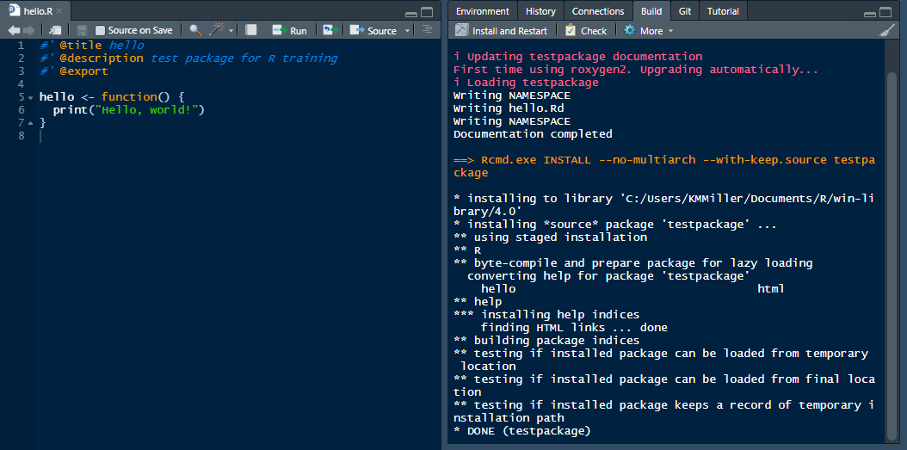

```{r setup, include=FALSE}
knitr::opts_chunk$set(echo = TRUE)
```

#### Intro to R Packages {.tabset}
<details open><summary class = 'drop'> Background </summary>
Once you've moved on from writing stand alone long R scripts to writing custom functions and iterating workflow, the next logical step is to start building your own custom package to more easily apply, document and share your code. 

<h2>Reasons to build an R package </h2>
<ul>
<li>Organize and document your code</li>
<li>One place to update your code</li>
<li>Easier to share across projects and with others</li>
<li>Using version control and packages together allows you to build and test new features without breaking the package for others.</li>
</ul>

Note: <b>Not everything needs to be a package!</b> If you're scripting a one-time analysis that you're never going to use again, it doesn't need to be a package. However, given that we're in the game of long-term monitoring, and we're often performing the same tasks with our data over and over, custom R packages are a powerful tool that, if well built, will add enormous efficiency to your workflow. 
</details>
<br>

<details open><summary class = 'drop'>Requirements</summary>
Before you can start building packages, you'll need the following installed and ready to use: 
<ul>
<li>R 4.0 or higher and recent version of RStudio. The more recent version, usually the better. </li>
<li><a href="https://cran.r-project.org/bin/windows/Rtools/rtools40.html">Rtools for R 4.x</a> (hopefully you installed this prior to this session.)</li>
<li>Packages: devtools, roxygen2. Both packages are actively being developed. To take advantage of the most features, and to make sure your computer behaves the way ours does, you should install the latest version of each. </li>
</ul>
<br>

Note that while you don't need GitHub to create a package, the workflow we are using today assumes you are using GitHub for version control and to host your package. Therefore we strongly encourage you to create a GitHub account and to start using GitHub version control alongside your package development.
</details>
<br>
<hr>

#### Create a Package

There are multiple ways to build a package, and it just keeps getting easier thanks to RStudio. The steps below are the ones that most consistently have worked for me as of January 2022. 

<details open><summary class = 'drop'>Creating a package with the file menu and git shell (the old way):</summary> 
<ol>
<li>Create a repo on Github</li>
<li>Open RStudio and create a new project</li>
  <ol>
  <li>Go to File > New Project > New Directory > R Package </li>
  <li>Name the package, specify the directory, check "Create git repo". Note that special characters, like underscores aren't allowed in package names. I'm going to call this testpackage2. </li>
  <li>Click "Create Project"</li></ol>
<li>Open git shell in RStudio by going to the Git tab in your Environment Pane. Click on the down arrow to the right of the gear box, and click on Shell. Once in the shell, type in the code, pressing return between each line, that is listed on github under "...or create a new repository on the command line"</li>
</ol>

Once those steps are completed, check that it worked by clicking on the blue down arrow in the git tab to pull from GitHub. If the down and up arrows are grayed out, something went wrong.

Example git shell code for setting up the repo on my account: 
<br>
```{r gitshell, echo=F, include=T, out.width='500px'}
knitr::include_graphics("./images/gitshell_init_code.png")
```
</details>
<br>

<details open><summary class = 'drop'>Creating a package in code (the easy way):</summary>
The easiest way to create a new package in RStudio is using the <i>usethis</i> package. You'll first need to have a GitHub account and have RStudio connected to your GitHub account. Once that's working, you can run the code below in your console.  

```{r altnewR, echo=T, eval=F}
usethis::create_package("D:/NETN/R_Dev/testpackage") # Creates a new package called testpackage. 
  # Be sure to update path to work for your computer.
usethis::use_git() # sets up local git for new package
usethis::use_github() # creates new github repo called testpackage. 
```

Obviously this is much easier than working through the git shell! This is the approach we recommend. Now that we have a new package created, we'll talk about the pieces that make up a package and look through the default files included in the package. 
</details>
<br>
<hr>

#### Package Anatomy
At a bare minimum, there are 2 files and 2 folders that make up an R package. DESCRIPTION and NAMESPACE are the required files. The R folder contains the functions, which you need to have at least one. The man folder contains the documentation for each function. There's an optional test folder that you can create unit tests for with your package. You can also create vignettes or git pages for your package to add even more documentation.

<details open><summary class = 'drop'>Package files explained </summary>
<ul>
<li><b>.gitignore:</b> add files you don't want to be pushed to your github repo. I often put my data folder on this list, so I don't accidentally push my data there.
<li><b>.gitbuildignore:</b> you can add files here that you don't want to be included in the build. I sometimes have temporary scripts that I'm testing with that I add here, so they're not included in the package install.
<li><b>DESCRIPTION:</b> This is the overall documentation for the package, including authors, version, package description, and imports and suggests.</li>
<li><b>man folder:</b> This is where the documentation for the functions is stored, and that also make up the help files for the package. By default, there's a Hello.Rd file there, which we'll delete. These files are generated by the roxygen2 code that are written for each function (more on that later).</li>
<li><b>NAMESPACE:</b> Documents the imports (i.e., package dependencies) and exports (i.e., your package functions) for your package. If you document the DESCRIPTION and function roxygen2 text correctly, this should be automatically populated for you. Occasionally something goes wrong and you have to modify the file manually. </li>
<li><b>R folder:</b> This is where your functions live. By default, there's a Hello.R function in that folder, which we'll delete.</li>
<li><b>README.md:</b> Use this README file to document more about your package beyond a 1-2 sentence description in the DESCRIPTION file. GitHub will display this README under the code on your repo page. You can also edit this file in GitHub, and then pull the changes into your RStudio project.</li>
<li><b>testpackage2.Rproj:</b> This is the name of the R project, which is also the same name as the package. This makes transferring the project to different directories or different computers easier. </li>
</ul>
</details>
<br>
<hr>

#### Package Development

<details open><summary class = 'drop'>Build Tools</summary>
Now that you have a skeleton of an R package started, it's time to start adding to it. But first, let's make sure the Build Tools are set up and functioning properly for your package. 

<ol><li>Go to Tools > Project Options > Build Tools. Make sure the "Generate documentation with Roxygen" box is checked.</li>
<li>If you're not directed to the Roxygen Options window, click on the "Configure" button. Make sure that under "Use roxygen to generate:", you at least have checks next to Rd files, Collate field, NAMESPACE file. Under Automatically roxygenize when running:", make sure you have checks next to R CMD check, Source and binary package builds, and Install and Restart. See graphic below as example. If you plan to build vignettes and want them to be rendered each time you rebuild your package, you can check that box too.</li>

```{r build1, echo=F, out.width = '500px'}
knitr::include_graphics("./images/Project_Options_Build_Tools.png")
```
<li>We're going to change the roxygen text at the beginning of hello.R to make sure the build updates the hello.rd in the man folder. 
<ol><li>First, delete the hello.Rd in the man folder. While you're at it delete the NAMESPACE in the main folder (we'll let Build Tools generate it from scratch).</li> 
<li>Now, open hello.R, and delete all of the commented text. </li>
<li>Add the following code at the top of the file, then save.</li>

```{r roxy, echo=T, eval=F}
#' @title hello
#' @description test package for R training
#' @export
```
</ol>
<li>If you have Rtools installed and correctly created your package, you should see a <b>Build</b> tab in your Environment Pane for that project. Click on "Install and Restart". The hello.R file and Build output should look like the image below. If the Build exited with status 1, then something is wrong with the roxygen text in your hello.R file. </li>
```{r build2, echo=F, out.width = '500px'}

```
<br>
<br>
<li>Now run the code below to view the help file you just made for the hello function in hello.R</li>
<br>
```{r hellohelp, echo=T, eval=F}
?testpackage::hello
```
</ol>

If the text you added shows up in the help file, your Build tools are all set.
</details>
<br>
