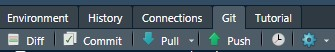
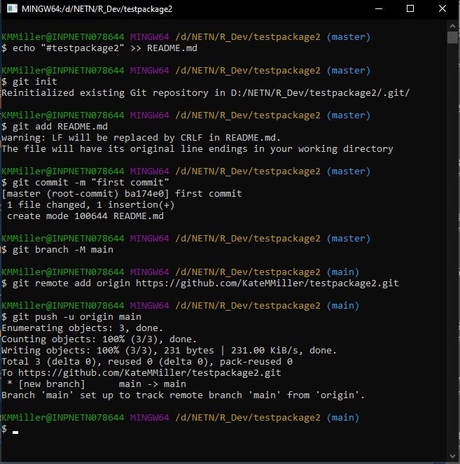
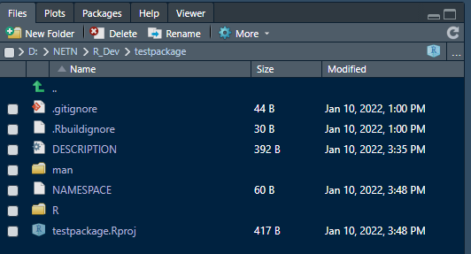

```{r setup, include=FALSE}
knitr::opts_chunk$set(echo = TRUE)
```

#### Intro to R Packages {.tabset}
<details open><summary class = 'drop'> Background </summary>
Once you've moved on from writing stand alone long R scripts to writing custom functions and iterating workflow, the next logical step is to start building your own custom package to more easily apply, document and share your code. 

<h3>Reasons to build an R package </h3>
<ul>
<li>Organize and document your code</li>
<li>One place to update your code</li>
<li>Easier to share across projects and with others</li>
<li>Using version control and packages together allows you to build and test new features without breaking the package for others.</li>
</ul>

Note: <b>Not everything needs to be a package!</b> If you're scripting a one-time analysis that you're never going to use again, it doesn't need to be a package. However, given that we're in the game of long-term monitoring, and we're often performing the same tasks with our data over and over, custom R packages are a powerful tool that, if well built, will add enormous efficiency to your workflow. 
</details>
<br>

<details open><summary class = 'drop'>Requirements</summary>
Before you can start building packages, you'll need the following installed and ready to use: 
<ul>
<li>R 4.0 or higher and recent version of RStudio. The more recent version, usually the better. </li>
<li><a href="https://cran.r-project.org/bin/windows/Rtools/rtools40.html">Rtools for R 4.x</a> (hopefully you installed this prior to this session.)</li>
<li>Packages: devtools, roxygen2. Both packages are actively being developed. To take advantage of the most features, and to make sure your computer behaves the way ours does, you should install the latest version of each. </li>
</ul>
<br>

Note that while you don't need GitHub to create a package, the workflow we are using today assumes you are using GitHub for version control and to host your package. Therefore we strongly encourage you to create a GitHub account and to start using GitHub version control alongside your package development.
</details>
<br>
<hr>

#### Create a Package

There are multiple ways to build a package, and it just keeps getting easier thanks to RStudio. The steps below are the ones that most consistently have worked for me as of January 2022. 

<details><summary class = 'drop'>Creating a package with the file menu and Git Terminal (the old way):</summary> 
<ol>
<li>Create a repo on Github</li>
  <ol>
  <li>Log into your GitHub account in your web browser (if not already logged in).</li>
  <li>In the upper-right corner of the page, click on the "+" button and select "New repository"</li>
  <li>Name the repository and leave the rest as is and click on the "Create repository" button at the bottom of the page. Leave the next page open, as you'll use the code example to connect your RStudio project to GitHub.</li>
  </ol>
<li>Open RStudio and create a new project</li>
  <ol>
  <li>Go to File > New Project > New Directory > R Package </li>
  <li>Name the package, specify the directory, check "Create git repo". Note that special characters, like underscores aren't allowed in package names. I'm going to call this testpackage2. </li>
  <li>Click "Create Project"</li></ol>
<li>Go to the Terminal Tab in your Console Pane (typically in bottom left of screen) and type in the code that is listed on github under "...or create a new repository on the command line", pressing return between each line. Note you can also open the Git Shell by going to the Git tab in your Environment Pane. Click on the down arrow to the right of the  gear box, and click on Shell). </li>
</ol>

Once those steps are completed, check that it worked by going to git tab to pull from GitHub. If the down and up arrows are grayed out, something went wrong. If they look like the image below, and you can pull down from GitHub, then you're all set.<br>


Example git code for setting up the repo on my account: 
<br>
```{r gitshell, echo=F, include=T, out.width='600px', fig.align='center'}
#------------------
# R Packages I
#------------------

```
</details>
<br>

<details open><summary class = 'drop'>Creating a package in code (the easy way):</summary>
The easiest way to create a new package in RStudio is using the <i>usethis</i> package. You'll first need to have a GitHub account and have RStudio connected to your GitHub account. Once that's working, you can run the code below in your console.  

<ol>
<li><b>Create a new package.</b> The code below should create a new package called testpackage and will open a project in a new R session.</li>
```{r altnewR, echo = T, eval = F}
usethis::create_package("D:/NETN/R_Dev/testpackage") # update to work with your file path
```

<li><b>Set up local git repository.</b> After running the code below, you'll be prompted whether it is okay to commit the files created by the package template. Select 1 (Absolutely). Then you'll be prompted to restart RStudio. Select 2 to restart. </li>
```{r altnewR2, echo = T, eval = F}
usethis::use_git() # sets up local git for new package
```

<li><b>Create GitHub repo.</b> After running the code below, you'll be prompted whether it is okay to commit the files created by the package template to GitHub. Select 3: Definitely. This will establish the connections to GitHub. If you don't select 3, you'll have to establish the connection manually via the Terminal. </li>
```{r altnewR3, echo = T, eval = F}
usethis::use_github() # creates new github repo called testpackage. 
```

<li><b>Add license and change branch name.</b> AFter you run the code below, your browser will open to your GitHub repo (assuming you have the same settings as my computer). You'll be prompted to click "OK" to change the branch from master to main. After you complete that step, you should see the green and blue arrows in your RStudio Git pane get activated.</li> 
```{r altnewR4, echo=T, eval = F}
usethis::use_mit_license() # set license to MIT license (or use a different license.)
usethis::git_default_branch_rename() # renames master to main 
```
</ol>

And you're done! Obviously this is much easier than working through the git shell. This is the approach we recommend, and this is the package we'll continue to build on through the training. We'll talk about the license piece later in the training. Now that we have a new package created, we'll talk about the pieces that make up a package and look through the default files included in the package. 
</details>
<br>
<hr>

#### Package Anatomy
The basic building blocks of an R package are defined in the list below. At a bare minimum, there are 2 files and 2 folders that make up an R package. The 2 required files are DESCRIPTION and NAMESPACE. The two folders are "R" and "man". Several additional files that improve documentation and git workflow are also added by RStudio's package template. Your Files pane should look something like this:



<details open><summary class = 'drop'>Package files explained </summary>
<ul>
<li><b>.gitignore:</b> add files you don't want to be pushed to your github repo. I often put my data folder on this list, so I don't accidentally push my data there.
<li><b>.gitbuildignore:</b> you can add files here that you don't want to be included in the build. I sometimes have temporary scripts that I'm testing with, but don't want to be included in the package. Adding them here prevents them from being included in the package build.
<li><b>DESCRIPTION:</b> This is the overall documentation for the package, including authors, version, package description, and imports and suggests.</li>
<li><b>man folder:</b> This is where the documentation for the functions is stored, and that also make up the help files for the package. By default, there's a Hello.Rd file there, which we'll delete. These files are generated by the roxygen2 code that are written for each function (more on that later).</li>
<li><b>NAMESPACE:</b> Documents the imports (i.e., package dependencies) and exports (i.e., your package functions) for your package. If you document the DESCRIPTION and function roxygen2 text correctly, this should be automatically populated for you. Occasionally something goes wrong and you have to modify the file manually. </li>
<li><b>R folder:</b> This is where your functions live. By default, there's a Hello.R function in that folder, which we'll delete.</li>
<li><b>README.md:</b> Use this README file to document more about your package beyond the 1-2 sentence description in the DESCRIPTION file. GitHub will display this README under the code on your repo page. You can also edit this file in GitHub, and then pull the changes into your RStudio project.</li>
<li><b>testpackage.Rproj:</b> This is the name of the R project, which is also the same name as the package. This makes transferring the project to different directories or different computers easier. </li>
<li><b>test folder:</b> We didn't add this, so you won't see it in your files. However, if you build unit tests (highly recommended, but not followed often enough), they'll live here.
</ul>
</details>
<br>
<hr>

