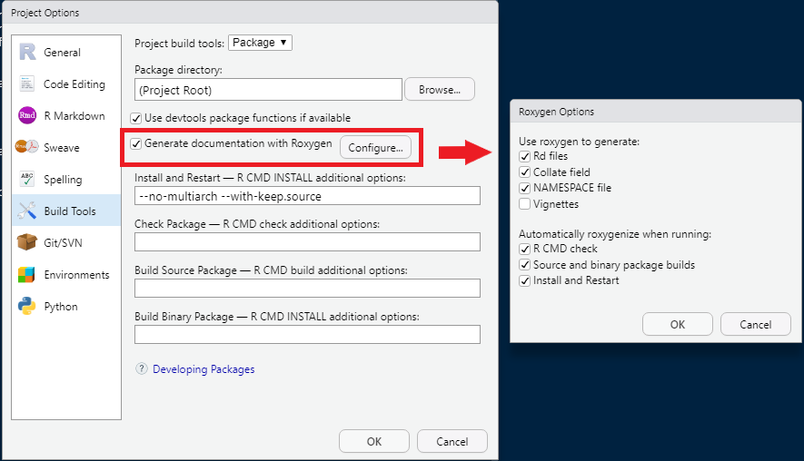
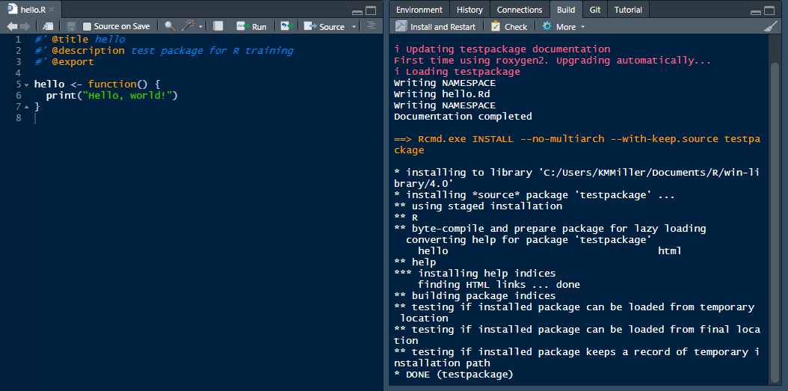
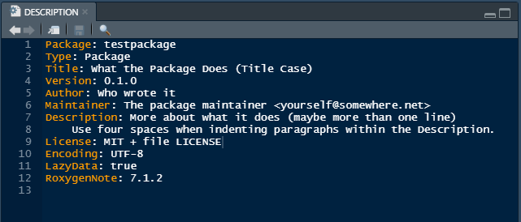
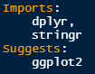
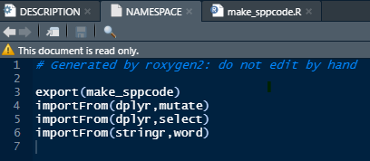
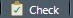

#### Build Tools

<details open><summary class = 'drop'>Build Tools</summary>
The last step before we get to start adding to our R package is to make sure the Build Tools are set up and functioning properly. 

<ol><li>Go to Tools > Project Options > Build Tools. Make sure the "Generate documentation with Roxygen" box is checked.</li>
<li>If you're not directed to the Roxygen Options window, click on the "Configure" button. Make sure that under "Use roxygen to generate:", you at least have checks next to Rd files, Collate field, NAMESPACE file. Under Automatically roxygenize when running:", make sure you have checks next to R CMD check, Source and binary package builds, and Install and Restart. See graphic below as example. If you plan to build vignettes and want them to be rendered each time you rebuild your package, you can check that box too.</li>

```{r build1, echo=F, out.width = '650px', fig.align = "center", dpi=600}
#------------------
# R Packages 2
#------------------

```
<li>We're going to change the roxygen text at the beginning of hello.R to make sure the build updates the hello.rd in the man folder. 
<ol><li>First, delete the hello.Rd in the man folder. While you're at it delete the NAMESPACE in the main folder (we'll let Build Tools generate it from scratch).</li> 
<li>Now, open hello.R, and delete all of the commented text. </li>
<li>Add the following code at the top of the file, then save.</li>

```{r roxy, echo=T, eval=F}
#' @title hello
#' @description test package for R training
#' @export
```
</ol>
<li>If you have Rtools installed and correctly created your package, you should see a <b>Build</b> tab in your Environment Pane for that project. Click on "Install and Restart" (or Crtl + Shift + B). The hello.R file and Build output should look like the image below. If you open your NAMESPACE file, you should see export(hello) listed. That's what @export does for you.</li>
```{r build2, echo=F, out.width = '650px',  fig.align = "center", dpi=600}

```
<br>
<br>
<li>Now run the code below to view the help file you just made for the hello function in hello.R</li>
<br>
```{r hellohelp, echo=T, eval=F}
?testpackage::hello
```
</ol>

If the text you added shows up in the help file, your Build tools are all set. If the Build exited with status 1, then something is wrong with the roxygen text in your hello.R file. Review the build results to see if you can find the line identified as failing. Also check that each of the lines you added are commented with both symbols ( `#'`), and that the terms following the @ are spelled correctly and don't have a space.

The last thing to do is delete the hello.R file to clean up the package. You don't need to delete the hello.Rd file, as it will be deleted the next time you rebuild your package.

</details>
<br>
<hr>

#### Package Development
<details open><summary class = 'drop'>Add and document the first function</summary>

Now we get to add to our package and make it useful! We're going to add a simple function to the package that I use all the time for my workflow. It's a function that takes the first 3 letters of a genus and species to create a species code. It saves me having to type out full species names when I'm filtering through a lot of data. 

To follow along, go to File > New R Script (or key Ctrl + Shift + N) and copy the code below to the script.

```{r fun1, echo=T, eval=F}
#' @title make_sppcode
#' @description Make a 6-letter code with first 3 letters of genus and species
#'
#' @importFrom dplyr mutate select
#' @importFrom stringr word
#'
#' @param data Name of data frame that contains at least one column with Latin names
#' @param sppname Quoted name of the column that contains the Latin names
#'
#' @return Returns a data frame with a new column named sppcode.
#' @export

make_sppcode <- function(data, sppname){
  data$genus = word(data[,sppname], 1)
  data$species = ifelse(is.na(word(data[,sppname], 2)), "spp.", word(data[,sppname], 2))
  data <- mutate(data, sppcode = toupper(paste0(substr(genus, 1, 3),
                                                substr(species, 1, 3))))
  data2 <- select(data, -genus, -species)
  return(data2)
}

```

Note in the Roxygen code above, we added the title, description, and export like we did for hello.R. We added a few more arguments to the Roxygen2 text at the top, including imports, params, and return.

<h3>Imports</h3>
Now we also added 2 imports, which are dependencies of your R package. The first are mutate and select in the dplyr package. The second is the word function in the stringr package. By adding these 2 lines to the Roxygen, these two functions will become part of the Namespace of the package (more on that later), and will be usable by any function in your package. 

If you use all base R functions within the functions of your package, you don't need to use imports. In general, best coding practices are to minimize the number of dependencies to reduce the number of packages a user needs to install before using your package, and make it less likely that your package code will break because a dependency was updated. I use them here to show you the workflow when you need dependencies (e.g., it's hard for me not to want dplyr at some point in a package). Another note is that `@importFrom` will only add the functions for that package in the Namespace, so you're less likely to have conflicts with other packages. If you want to make the entire package available to the package Namespace (e.g., I've done this with ggplot2), then you'd write: `#' @import ggplot2`

<h3>Parameters</h3>
Parameters are where you define the inputs to your function. If an input only takes certain arguments, like TRUE/FALSE, or a list of park codes, `@param` is how you document that to the user. Note that if your package functions share the same parameters, you can inherit parameters from other functions, instead of having to copy/paste them across functions by adding `#' @inheritParams make_sppcode`.

<h3>Return</h3>
The `@return` argument tells the user what to expect as the output of the function. 

<h3>Export</h3>
This `@export` argument tells R to export that function into the NAMESPACE file.
</details>
<br>

<details open><summary class = 'drop'>Update DESCRIPTION file</summary>

There's one last piece of documentation we need to complete before dependencies will be installed when your package is installed. Open the DOCUMENTATION file. It should look like: <br>

<br>
You'll want to update the <b>Title</b>, <b>Author</b>, <b>Maintainer</b>, and <b>Description</b>, which are pretty self-explanatory. As you update your package, you'll also want to update the Version number. Next we need to add the <b>Imports</b> and <b>Suggests</b> to the DESCRIPTION, which are defined below. <br>
<b>Imports:</b> Packages listed under Imports will be installed at the same time your package is installed. You can also set the minimum version number that, if users don't have, will be installed. <br>
<b>Suggests:</b> These packages are not installed at the time your package is installed. Suggests are helpful for external packages that are only used by one or a few functions in your package. For example, one of our packages has a function that imports data directly from our SQL Server, but only a few network staff can access the server. The external packages that the SQL import function uses are listed under Suggests. The SQL import function then checks to see if the suggested packages are installed on the user's computer. If not, it will stop and print an error that it needs to be installed. We'll show that workflow later. 

You can either manually add these to the DESCRIPTION file like:
<br>

OR, you can use the usethis package to do the heavy lifting!
```{r sugimp, echo=T, eval=F}
usethis::use_package("dplyr") # for imports which is the default
usethis::use_package("stringr") # for imports which is the default
usethis::use_package("ggplot2", "Suggests") # for suggests
```

Note also that the <b>License</b> should be MIT + file LICENSE, if you followed the usethis workflow we showed earlier to create the package. I don't know a lot about licenses, other than it's best practice to set one. The MIT license is the most common passive license that means your code is open source and allows anyone to copy code with minimal restrictions. If you want all derivatives of your code to be open source, the GPLv3 license is the most common license (`usethis::use_gpl_license()`).  
</details>
<br>

<details open><summary class = 'drop'>Rebuild and Document package</summary>
We're finally ready to document the package (note you could have done it after each step). Go to the Build tab and click "Install and Restart" (or Ctrl + Shift + B). Assuming the roxygen and DESCRIPTION were written correctly, you should now see a make_sppcode.Rd in the man folder. You can also check that help works for the function: 

```{r testhelp, eval=F} 
?testpackage::make_sppcode
```
</details>
<br>

<details open><summary class = 'drop'>Check your NAMESPACE</summary>
Open your NAMESPACE file. It should look like this: <br>
<br>

The Namespace should contains all of the functions you've built for your package as exports, along with all of the external dependencies you are using within your functions as imports. As you add more functions and dependencies, they are added here each time you rebuild your package. You can also store data in the namespace, which can then be accessed by your package functions. 

The concept of Namespace is a special beast, and can be a bit hard to wrap your head around. In a nutshell each package has its own environment that contains all the package's functions, dependencies and objects (e.g., data) that have been defined for that package. This environment is separate from your global environment. When you load a package in your session, the package's environment is accessible, but only through its functions. For example, dplyr is a dependency of our testpackage, When we load testpackage (e.g., `library(testpackage)`), the testpackage's functions can use dplyr. However, if we need dplyr outside of testpackage functions, we have to load it first.

</details>
<br>
<details open><summary class = 'drop'>Test your package</summary>
Now that the documentation is all set, let's test that the `make_sppcode()` function actually works! Try running the code below to see if it works. 

```{r testfun}
library(testpackage)
example_dat <- data.frame(Latin_Name = c("Carex limosa", "Arethusa bulbosa", 
                                         "Malaxis unifolia", "Calopogon tuberosus"), 
                          cover = c(10, 40, 10, 50),
                          stems = c(50, 20, 10, 10))

example_dat2 <- make_sppcode(example_dat, "Latin_Name")
head(example_dat2)
```
</details>
<br>

<details open><summary class='drop'>Add Examples</summary>
While examples are not required, they are by far the best way to help users understand how to use your functions. They're also breadcrumbs for future you as a reminder of how it works. Examples work best when you first create a simple fake data set to run with the function. That way, a user can easily reproduce and run the code on their machine. We just created the example we're going to add in the process of testing the function. The code chunk below shows how to add it. Note that if you want to show an example that takes a long time to run, so don't want it to run while building or checking the package, you can add `\dontrun{ example code here }`. 


```{r fun3, echo=T, eval=F}
#' @title make_sppcode
#' @description Make a 6-letter code with first 3 letters of genus and species
#'
#' @importFrom dplyr mutate select
#' @importFrom stringr word
#'
#' @param data Name of data frame that contains at least one column with Latin names
#' @param sppname Quoted name of the column that contains the Latin names
#'
#' @return Returns a data frame with a new column named sppcode.
#'
#' @examples
#' library(testpackage)
#' 
#' example_dat <- data.frame(Latin_Name = c("Carex limosa", "Arethusa bulbosa", 
#'                                          "Malaxis unifolia", "Calopogon tuberosus"),
#'                           cover = c(10, 40, 10, 50),
#'                           stems = c(50, 20, 10, 10)))
#'
#' example_dat2 <- make_sppcode(example_dat, "Latin_Name")
#' head(example_dat2)
#'
#' @export

make_sppcode <- function(data, sppname){
  data$genus = word(data[,sppname], 1)
  data$species = ifelse(is.na(word(data[,sppname], 2)), "spp.", word(data[,sppname], 2))
  data <- mutate(data, sppcode = toupper(paste0(substr(genus, 1, 3),
                                                substr(species, 1, 3))))
  data2 <- select(data, -genus, -species)
  return(data2)
}

```

</details>

<details open><summary class = 'drop'>Run CMD Check</summary>
The last thing you need to do before posting your package to GitHub for others to use is to run the R CMD check. You can do this 3 ways. You can either click on the Check ( ) in the Build tab, press Ctrl + Shift + E, or run devtools::check().

The R CMD Check runs through your package to ensure all required and suggested files exists, identifies potential typos/errors in the ROxygen2 code for each function, lets you know about imports you may have forgotten to add to your NAMESPACE, etc. It's best practice to run this check before sharing/posting it for others.  
</details>

<hr>