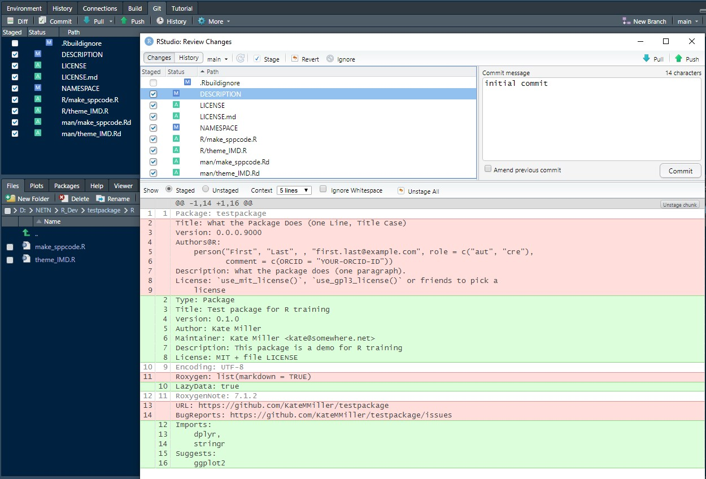

```{r include = F}
#------------------
# R Packages III
#------------------
library(stringr)
library(dplyr)
example_dat <- data.frame(Latin_Name = c("Carex limosa", "Arethusa bulbosa", 
                                         "Malaxis unifolia", "Calopogon tuberosus"), 
                          cover = c(10, 40, 10, 50),
                          stems = c(50, 20, 10, 10))

```

#### Error Handling
Thoughtful and thorough error handling make your package user friendly. Coding best practices are to have as many checks at the beginning of your function as possible to catch common (or even uncommon) issues that are likely to happen, and to have a clear error or warning message for each check. This is often referred to as "Fail early". That way, the user won't be waiting for code to run, only for it to fail a few minutes later with a vague or misleading error message. If you don't have error handling in your function, the error is often the first external function that failed to run and that has built-in error handling, rather than an error message at the line of code where the actual function failed. 

<details open><summary class = 'drop'>Checking for Suggests </summary>
We're going to add one more function to our testpackage, so we can talk about suggests (i.e. suggested packages that aren't automatically installed when your package is installed) and error handling. The function will be called theme_IMD and will specify a custom theme for ggplot2, which is one of our suggests. Open a new script, name it theme_IMD, and copy the code chunk into it. 

```{r newfun, eval=F, echo=F}
#' @title theme_IMD: custom ggplot2 theme for forestNETN
#'
#'
#' @description This is a custom ggplot2 theme that removes the default panel grids
#' from ggplot2 figures, and makes the axes and tick marks grey instead of black.
#'
#' @return This function must be used in conjunction with a ggplot object, and will return a ggplot object with the custom theme.
#'
#' @examples
#' example_dat <- data.frame(Latin_Name = c("Carex limosa", "Arethusa bulbosa",
#'                                          "Malaxis unifolia", "Calopogon tuberosus"),
#'                           cover = c(10, 40, 10, 50),
#'                           stems = c(50, 20, 10, 10))
#' library(ggplot2)
#' p <- ggplot(data = example_dat, aes(x = cover, y = stems)) +
#'      geom_point() +
#'      theme_IMD()
#' p
#'
#' @export


theme_IMD <- function(){

  # Check that suggested package required for this function is installed
  if(!requireNamespace("ggplot2", quietly = TRUE)){
    stop("Package 'ggplot2' needed for this function to work. Please install it.", call. = FALSE)
  }

  ggplot2::theme(panel.grid.major = ggplot2::element_blank(),
                 panel.grid.minor = ggplot2::element_blank(),
                 panel.background = ggplot2::element_rect(color = '#696969', fill = 'white', size = 0.4),
                 plot.background = ggplot2::element_blank(),
                 strip.background = ggplot2::element_rect(color = '#696969', fill = 'grey90', size = 0.4),
                 legend.key = ggplot2::element_blank(),
                 axis.line.x = ggplot2::element_line(color = "#696969", size = 0.4),
                 axis.line.y = ggplot2::element_line(color = "#696969", size = 0.4),
                 axis.ticks = ggplot2::element_line(color = "#696969", size = 0.4)
)}

```

Notice the line that checks whether ggplot2 is installed on the user's machine. If ggplot2 isn't installed on the user's machine, the function will fail immediately, and will print "Package 'ggplot2' needed for this function to work. Please install it." in the console. This check only happens for functions that have this code in it. Note that for suggests, you also have to use the package:: approach to specify its functions. This is always a messy business for ggplot2...

</details>

<details open><summary class = 'drop'>Additional checks</summary>

There are tons of possible checks you can do. I often peek under the hood of packages that are well-designed to see what types of checks the pros actually use. You can view the code under the hood of a function by pressing the F2 key and clicking on the function. 

Some examples of checks I commonly use are `match.arg()`, which makes sure arguments match between what the function allows and what the user specified. The `stopifnot(class(argument) == 'classtype')` is helpful to ensure numbers or logical arguments are specified properly. Other checks I often include are making sure the data sets that the function uses exist in the global environment. The code below is an excerpt from a function in our forestNETN package that compiles tree data. The first part of the code is checking the arguments specified by the user. The `tryCatch()` is looking for COMN_TreesByEvent object. If it exists, it will name it tree_vw. If it doesn't it will exit the function and print the error quoted in the `stop()` into the console. 

```{r eval=F}
joinTreeData <- function(park = 'all', from = 2006, to = 2021, QAQC = FALSE, locType = c('VS', 'all'), panels = 1:4,
                         status = c('all', 'active', 'live', 'dead'), 
                         speciesType = c('all', 'native','exotic', 'invasive'),
                         canopyPosition = c("all", "canopy"), dist_m = NA, 
                         eventType = c('complete', 'all'), output = 'short', ...){

  # Match args and classes
  status <- match.arg(status)
  park <- match.arg(park, several.ok = TRUE,
                    c("all", "ACAD", "MABI", "MIMA", "MORR", "ROVA", "SAGA", "SARA", "WEFA"))
  stopifnot(class(from) == "numeric", from >= 2006)
  stopifnot(class(to) == "numeric", to >= 2006)
  locType <- match.arg(locType)
  stopifnot(class(QAQC) == 'logical')
  stopifnot(panels %in% c(1, 2, 3, 4))
  output <- match.arg(output, c("short", "verbose"))
  canopyPosition <- match.arg(canopyPosition)
  speciesType <- match.arg(speciesType)
  
  # Check for tree data in global environment
  tryCatch(tree_vw <- COMN_TreesByEvent,
           error = function(e){stop("COMN_TreesByEvent view not found. Please import view.")}
  )

  }
```

Error handling could take an entire day or more to cover fully, but that's about all we have time for today. For more detail, <a href="https://adv-r.hadley.nz/conditions.html">Chapter 8 Conditions</a> in the Advanced R book covers this topic quite thoroughly. Another useful resource is <a href="https://bookdown.org/rdpeng/RProgDA/error-handling-and-generation.html">Chapter 2.5 Error Handling and Generation</a> in the Mastering Software Development in R.  

</details>
<hr>

#### Debugging
Debugging is another big topic that we only have time to scratch the surface. For further reading, the best resource I've found on debugging is <a href="https://adv-r.hadley.nz/debugging.html">Chapter 22 Debugging</a> in the Advanced R book.

<details open><summary class='drop'>Low-tech debugging</summary>
The simplest form of debugging is to load the dependencies and define objects in your global environment that will feed into the function, and then to run the code in the function under the hood. A simple example with the make_sppcode function is in the code chunk below. Note that I commented out the lines that start and end the function.

```{r debug1, error=T}
# dependencies
library(stringr)
library(dplyr)

#function args
data <- example_dat
sppname <- "Latin_Name"

#make_sppcode <- function(data, sppname){
  data$genus = word(data[,sppname], 1)
  data$species = ifelse(is.na(word(data[,sppname], 2)), "spp.", word(data[,sppname], 2))
  data <- mutate(data, sppcode = toupper(paste0(substr(genus, 1, 3),
                                                substr(species, 1, 3))))
  data2 <- select(dat, -genus, -species)
#  return(data2)
#}
```

In the example above, we found that the line with `select(dat, -genus, -species)` had a typo: dat should have been data. 
</details>
<br>

<details open><summary class = 'drop'>Using `traceback()`</summary>
There are several other built-in R functions that can help with debugging. The two I use the most often are `traceback()` and `debug()`. To show how `traceback()` works, let's create a function that we know has an error. Copy this code to your R session and run it. You should see make_sppcode_error show up in your global environment after you run it.  

```{r funerror, error=T}
make_sppcode_error <- function(data, sppname){
  data$genus = word(data[,sppname], 1)
  data$species = ifelse(is.na(word(data[,sppname], 2)), "spp.", word(data[,sppname], 2))
  data <- mutate(data, sppcode = toupper(paste0(substr(genus, 1, 3),
                                                substr(species, 1, 3))))
  data2 <- select(dat, -genus, -species)
  return(data2)
}
```

Now try to use the function:
```{r funerror2, error=T}
make_sppcode_error(example_dat, sppname = "Latin_Name")

```

It should fail, and the error message tells you that object 'dat' not found. You could then go look under the hood in your function to try to find where dat lived. Or, you can use `traceback()`, which shows you the code and line number that failed. If you have functions from your package that this function uses, and the other function is what failed, `traceback()` will tell you that too. Run the code below to see for yourself. 

```{r funerror3, eval=F}
traceback()
```
</details>
<br>

<details open><summary class = 'drop'>The Magic of `debug()`</summary> 
The `debug()` function allows you to look under the hood of a function and steps through the function code one line at a time. You can see the outputs of each line, and even interact with/change them to test how the function behaves. Once you get the hang of it, you'll never go back to the low-tech debugging approach I described first. 

The code chunk below shows how to start using the `debug()` function to step through the `make_sppcode_error()` function. It's hard to show with R Markdown, but we'll demo how to walk through the browser in `debug()` in a minute. Once you run the code below, your console will show a message that starts with "debugging in: make_sppcode_error(data, "Latin_Name"). You'll also see a `Browse[2]>` below, where you can enter one of several options: 

<ul>
<li><b>n</b> to execute the next line of code</li>
<li><b>s</b> to step into the the function calls in the next line of code. This means that if there's a function in that next line, it will open a browser to debug that function. This is really helpful when you have another package function within that function that's failing, because you're able to interact with it in the exact scenario where it's failing.</li>
<li><b>c</b> to continue to the end function and exit the browser </li>
<li><b>f</b> to run through to the end of the function but keep the browser open </li>
<li><b>Q</b> to exit the browser and stop debugging.</li>
</ul>

```{r debugwindow, error = T, eval = F}
debug(make_sppcode_error)
make_sppcode_error(data, "Latin_Name")

```

In our case, we'll enter `n` and step our way through the function, printing the `head(data)` to make sure it looks the way we expect. Eventually we'll find that the function fails on the `select(dat, ...)` line. Then we'll exit out by pressing `Q` or `c`. 

</details>
</br>
<hr>

#### Share Package on GitHub
<h3>Post to GitHub </h3>
We're finally be ready to post our package to GitHub. You'll want to run the build (Ctrl + Shift + B or "Install and Restart" in Build tab) and check (Ctrl + Shift + E or "Check" in Build tab) one last time. If all checks out, then go to the Git tab in your environment pane. Click on the Commit button, which will open a pane like below. Go ahead and check all but the gitignore files, add a commit message, and then press commit. This will stage the changes. The last step is pushing to GitHub using the green up arrow in the top right. After you push to GitHub, you should see that your GitHub repo in your browser has the new files/changes in the main branch. You might need to refresh the page (F5). 

```{r gitcom, echo=F, out.width = '650px', fig.align = "center", dpi=600}

```

<h3>Install from GitHub</h3>
The package is is currently only installed on your local machine. The easiest way for others to use your package are for them to install the package using devtools. This will install the package based on the code in the `main` branch. Packages can also be installed from a branch by adding `ref = 'branchname'` to the function call.

```{r instgit, echo = F, eval = F}
devtools::install_github("KateMMiller/testpackage")
```

The other way to install the package is for the user to go through the process of cloning the GitHub repository to their local machine and then using the build tool to build the package on their machine. This is the preferred method only if other users of your package are also interested in contributing to the package. Be sure to use branches to keep the main branch protected, so that `install_github()` continues to work as you're developing your package. 
<br>
<hr>

#### Resources

```{r rpkgres, child = "IMD_Resources_D4_R_packages.Rmd", eval = T}

```


<br>
<hr>