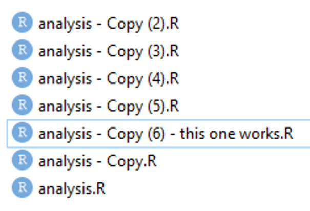
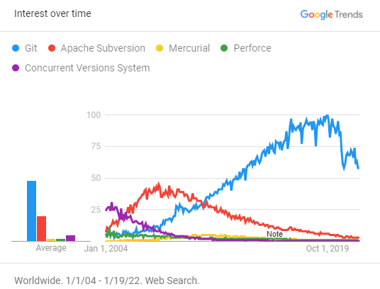

#### Intro to version control

##### Background

As you become more familiar with coding in R, your code will become longer and more complex. You will have projects that you revisit and update each year. You may wish to share your code with others and allow them to make suggestions and contributions.

If your code was a Word document, this is the point where you would turn on Track Changes. Think of version control as Track Changes for your code. Version control is much more sophisticated and flexible, which means that it comes with a steeper learning curve. If you come away from this class feeling like you have no idea what you are doing, don't despair! Embrace the learning curve and remember that you don't have to be an expert in version control to take advantage of its most useful features.

##### Why version control...?

{width=250px}

...because we've all been here before. Version control is worth the learning curve because:

  - It lets you take snapshots of your progress, creating a full long-term change history for each file in your project
  - It makes it easier to keep track of the latest working version of your code
  - It makes it easier to merge your changes with changes that your collaborators have made
  - It makes it easier to identify and recover from mistakes
  
##### Requirements

There are a variety of version control systems available. We will be using Git, since it is by far the most commonly used system and it is free and open source.

{width=400px}

You'll need the following installed and ready to use prior to this course:

 - R 4.0 or higher and recent version of RStudio. The more recent version, usually the better.
 - The latest version of [Git for Windows](https://git-scm.com/download/win)
