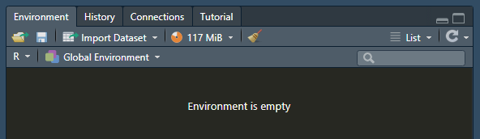
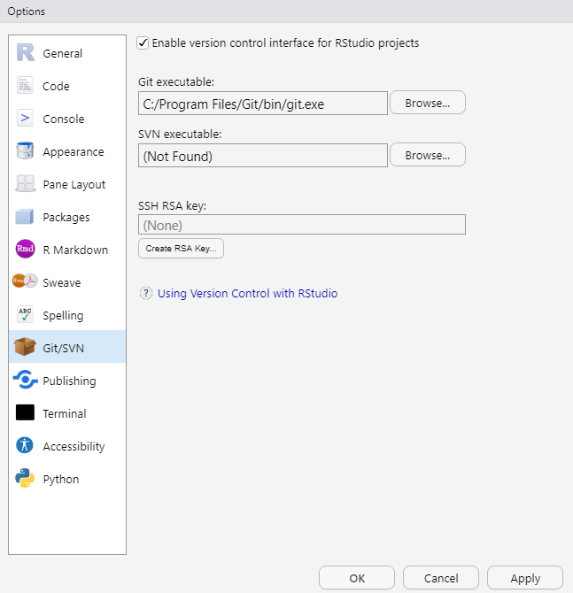
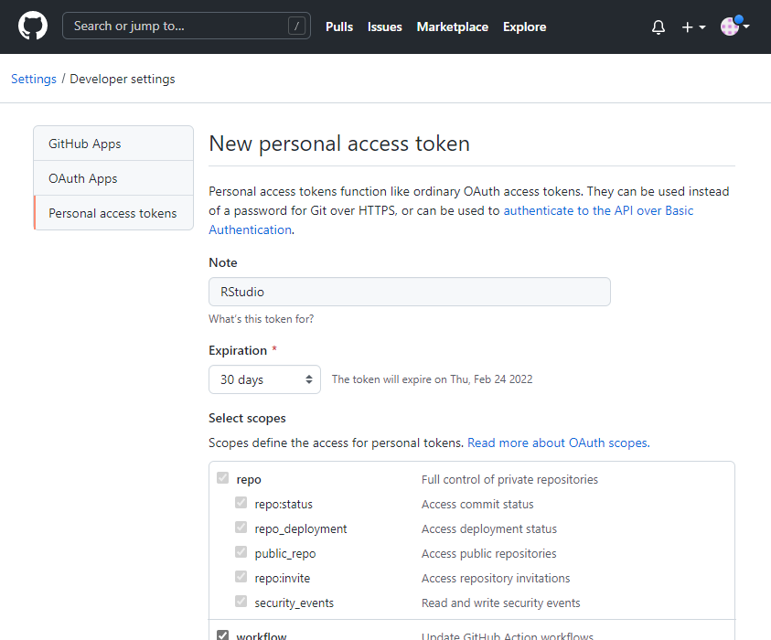
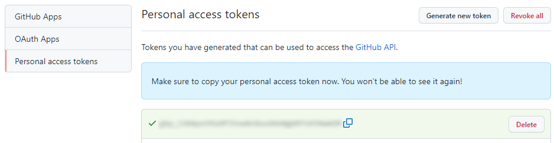

#### Git and RStudio

You can use Git completely independently from RStudio if you want to, but for the purposes of this class we'll use RStudio's built-in Git client. It's not especially powerful, but it's simple and convenient!

##### First-time setup

Open RStudio. If you have a project open, close it out by going to **File > Close Project**. Look in the top right pane - at this point, the Git tab will *not* be present.



Go to **Tools > Global Options**. In the list on the left, select **Git/SVN**. Make sure that the **Enable version control interface for RStudio projects** box is checked and verify that everything looks like the screenshot below (your git.exe path may differ, that's ok).



Click **Apply**, then **OK**. Now RStudio should be set up to use Git.

Now you need to connect your GitHub account. The easiest way to do this is to use the `usethis` package.

**Step one: create a personal access token**

GitHub uses personal access tokens for authentication. Instead of entering your GitHub username and password into RStudio, you'll create an access token and store that. A personal access token is more secure because you can revoke it at any time, you can set it to expire after a fixed amount of time, and it doesn't provide full access to your account. However, you should treat it like a password: don't share it with others, don't hard-code it into a script, etc. If you must save it somewhere (not necessary), use a password manager like KeePass.

```{r MakeGHToken, eval=FALSE}
# This opens up a browser window where you can create a personal access token. It may ask you to log into GitHub or confirm your password.
usethis::create_github_token()
```

Once you are logged into GitHub, you should see a page that looks like this:



Put something descriptive in the **Note** field, like "RStudio". Next, look at the **Expiration** dropdown. By default, tokens are set to expire after 30 days, at which point you will have to repeat this process. You have the option to set the expiration date to later or never. Use your best judgment. You can leave the scope settings as-is. Scroll to the bottom and click **Generate token**. The only time that GitHub will show you your personal access token is when you create it. So make sure you copy it to your clipboard so that you can finish connecting to GitHub from RStudio!



**Step two: insert your personal access token in the Git credential store**

Run the code below and when prompted, paste in your personal access token.

```{SetGHCreds, eval=FALSE}
gitcreds::gitcreds_set()
```

If you already have Git credentials stored, `gitcreds_set()` will prompt you to keep or replace them. Unless you have recently gone through the process of creating a personal access token, go ahead and allow it to replace them with your new access token.
