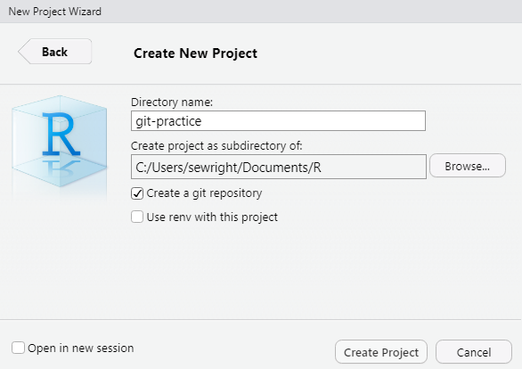
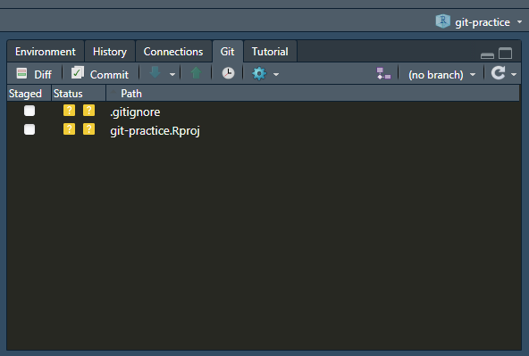
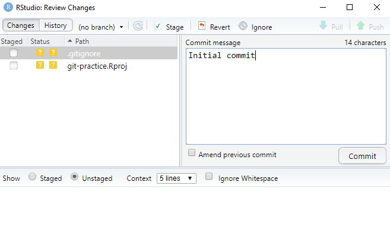
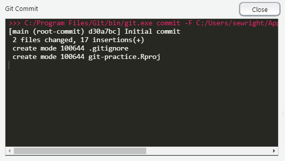
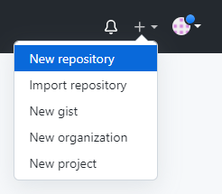
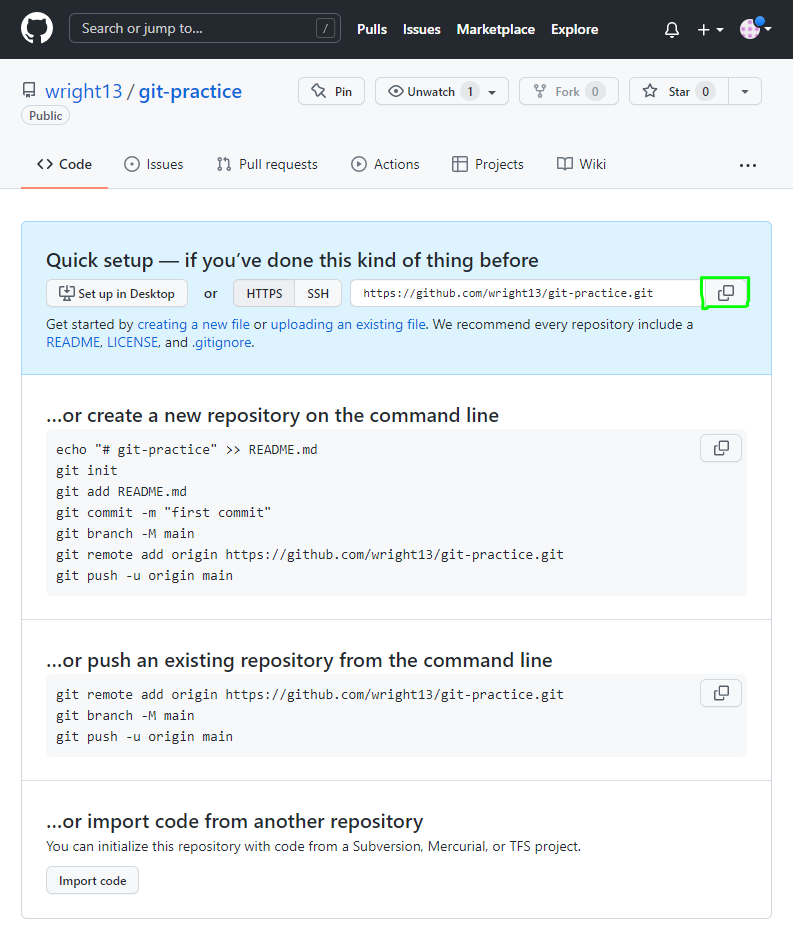
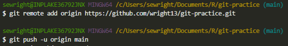
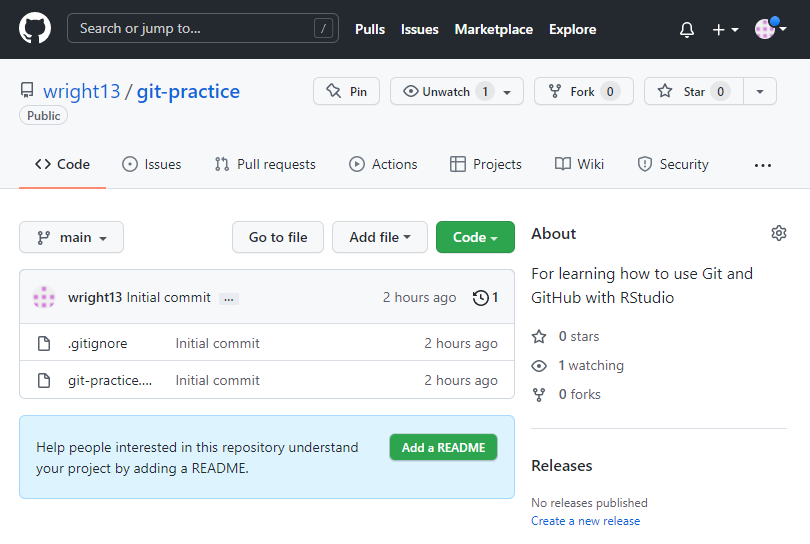
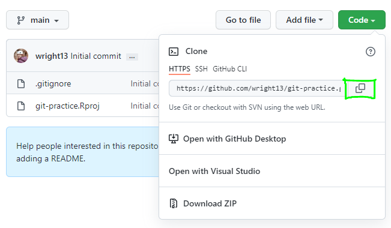
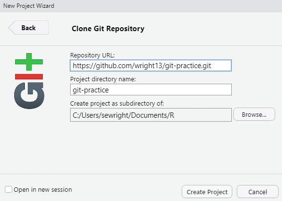

#### Git and RStudio

You can use Git completely independently from RStudio if you want to, but for the purposes of this class we'll use RStudio's built-in Git client. Without it, you have to type Git commands in the terminal. You can download other Git clients that do more than the one in RStudio, but we'll stick with RStudio in this class since it's simple and convenient.

##### First-time setup

Open RStudio. If you have a project open, close it out by going to **File > Close Project**. Look in the top right pane - at this point, the Git tab will *not* be present.


Go to **Tools > Global Options**. In the list on the left, select **Git/SVN**. Make sure that the **Enable version control interface for RStudio projects** box is checked and verify that everything looks like the screenshot below (your git.exe path may differ, that's ok).

{width=500px}

Click **Apply**, then **OK**. Now RStudio should be set up to use Git.

Now you need to connect your GitHub account. The easiest way to do this is to use the `usethis` package.

**Step one: create a personal access token**

GitHub uses personal access tokens for authentication. Instead of entering your GitHub username and password into RStudio, you'll create an access token and store that. A personal access token is more secure because you can revoke it at any time, you can set it to expire after a fixed amount of time, and it doesn't provide full access to your account. However, you should treat it like a password: don't share it with others, don't hard-code it into a script, etc. If you must save it somewhere (not necessary), use a password manager like KeePass.

```{r MakeGHToken, eval=FALSE}
# This opens up a browser window where you can create a personal access token. It may ask you to log into GitHub or confirm your password.
usethis::create_github_token()
```

Once you are logged into GitHub, you should see a page that looks like this:

{width=800px}

Put something descriptive in the **Note** field, like "RStudio". Next, look at the **Expiration** dropdown. By default, tokens are set to expire after 30 days, at which point you will have to repeat this process. You have the option to set the expiration date to later or never. Use your best judgment. You can leave the scope settings as-is. Scroll to the bottom and click **Generate token**. The only time that GitHub will show you your personal access token is when you create it. So make sure you copy it to your clipboard so that you can finish connecting to GitHub from RStudio!

{width=700px}

**Step two: insert your personal access token in the Git credential store**

Run the code below and when prompted, paste in your personal access token.

```{SetGHCreds, eval=FALSE}
gitcreds::gitcreds_set()
```

If you already have Git credentials stored, `gitcreds_set()` will prompt you to keep or replace them. Unless you have recently gone through the process of creating a personal access token, go ahead and allow it to replace them with your new access token.

##### Creating a new project

The easiest way to create a new RStudio project with a Git repository is to go to **File > New Project > New Directory > New Project** and make sure to check the **Create a git repository** box before you click the **Create Project** button.



Alternately, you can use the `usethis::create_project()` and `usethis::use_git()` functions to initialize a project with a Git repository. `usethis::use_git()` is also the easiest way to add a Git repository to an existing project.

At this point you should have an empty project open in RStudio, and you should see a Git tab in the top right panel. Note that everything you have created so far exists only on your local hard drive - we haven't done anything with GitHub yet.

Click on the Git tab. If you used the create package wizard, you'll see two files with yellow question marks next to them.



The question marks mean that Git recognizes that you've created new files, but it is not tracking changes to them yet. It seems like it should start tracking change by default, like a word processor, but we don't necessarily want Git to track every file we create in our project folder. Remember that eventually we're going to put our repository on GitHub, in the cloud. GitHub has privacy settings, but even so we don't want to store things like sensitive or unpublished data there. Information for connecting to a database is another example of something we might store in our project folder but wouldn't want to publish to GitHub.

Before we do anything else, let's make our first commit. Remember, think of a commit as a snapshot of our project at a given point in time. In the Git tab, click on the **Commit** button. 



There's not much to see here yet. Note the **Staged** column in the file list. In order to stage a file for commit, click the checkbox next to it. Go ahead and stage both files. Note the green A next to each file: this means that you've told Git to include the contents of the file in the next commit. A common misconception is that checking the Staged box actually creates a new commit. That's not the case, though! You've composed your snapshot, but you haven't pressed the shutter button.

To actually commit the staged files, enter something brief but descriptive in the **Commit message** box ("Initial commit" is typically used for the first commit). Then click on the **Commit** button. Now you've taken your snapshot! Git will give you some feedback, letting you know that your commit includes 17 new lines of code in two files, and two new files were created: .gitignore and git-practice.Rproj.



Click **Close**.

##### Creating a GitHub repository

At this point, it's time to create a home for your project on GitHub. Even if you never share your GitHub repository with anyone else, it's a great place to back up your code. Log into GitHub and click the **+** in the top right corner. Select **New repository**. 



Leave **Repository template** set to **No template**. Give your repository a name. Ideally this should match the name of your project, for your own sanity, but it doesn't have to. Go ahead and include a very brief description of your project. For the purpose of this class, set your repository to **Public**. In general, use your best judgment when it comes to public vs. private repositories. 

Things to consider: how easily do you want to share your code with others? Can your code benefit others? Is there a risk of accidentally committing sensitive information to the repository? Is there any sensitive information in your code? You should never ever hard-code things like login information, but something like code pertaining to sensitive species in a park might be worth keeping private.

In the **Initialize this repository with:** section, leave all the boxes unchecked. You already have a .gitignore file and you'll create a README later. Don't worry about a license for this code. Click **Create Repository** and copy the URL to your repository as shown below.



##### Connecting a local Git repository to GitHub

Now you have a local repository on your hard drive and a repository in GitHub (often referred to as a *remote* repository). Now it's time to make them talk to each other. From the terminal tab in RStudio (still in your git-practice project), follow the "push an existing repository from the command line" instructions shown in your GitHub repository. Make sure to replace the URL with the URL to your own GitHub repository!

If you don't see a terminal tab next to your console tab, go to **Tools > Terminal > New Terminal**.



If this is successful, you'll see several lines of feedback in the terminal, ending in "Branch 'main' set up to track remote branch 'main' from 'origin'." Verify that everything worked correctly by refreshing the webpage for your GitHub repository. 

{width=800px}

Finally, look at the Git tab. The green and blue arrow buttons should no longer be grayed out and there should be no files listed as changed or added.

##### Other setup scenarios

**Existing project without local Git repo**

If you have an existing project but you didn't check the **Create a git repository** box when you created it, don't despair. Make sure your project is open, then go to the **Terminal** tab, type `git init`, and hit **Enter**. Now you can create and connect a GitHub repository as described above.

**New project from existing GitHub repo**

This is a very common workflow. This what you will do if someone shares a GitHub repository with you and asks you to contribute to it. You can also do this if you want to create a new GitHub repository first, then a new project. In GitHub, copy the repository URL:



Next, open RStudio and go to **File > New Project**. In the popup, select **Version Control**, then **Git**. Under **Repository URL**, paste the URL that you just copied from GitHub. **Project directory name** should default to the repository name. If not, just type it in. For **Create project as subdirectory of:**, select whichever folder you want to store your R projects in. Click **Create Project**. You're done! You now have an R project containing the code from the GitHub repository. It's already set up with a local repository and a connection to the GitHub repository. Make sure the owner of the GitHub repository has set the permissions so that you can push to it.



This is known as *cloning* a repository - you are copying the whole GitHub repository to your local hard drive, and setting up your new local repository to sync with the GitHub repository when you ask it to.
