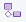
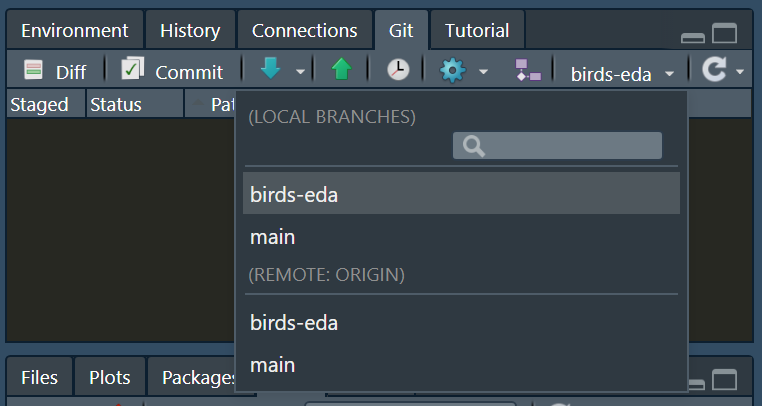
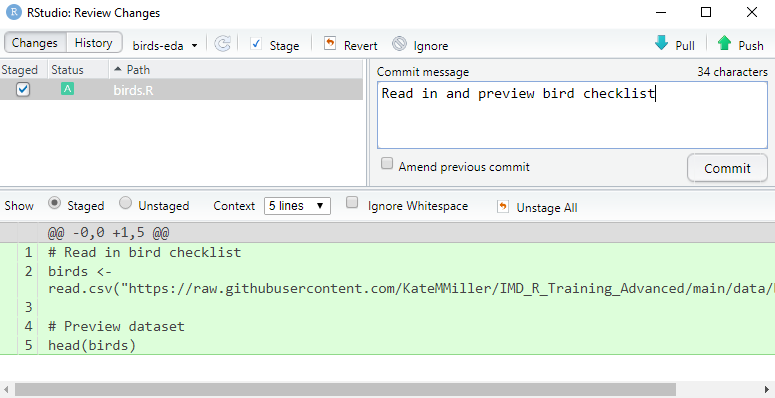
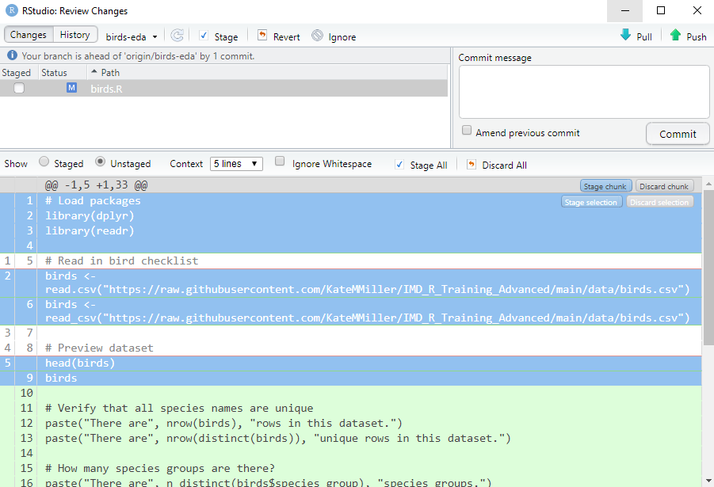
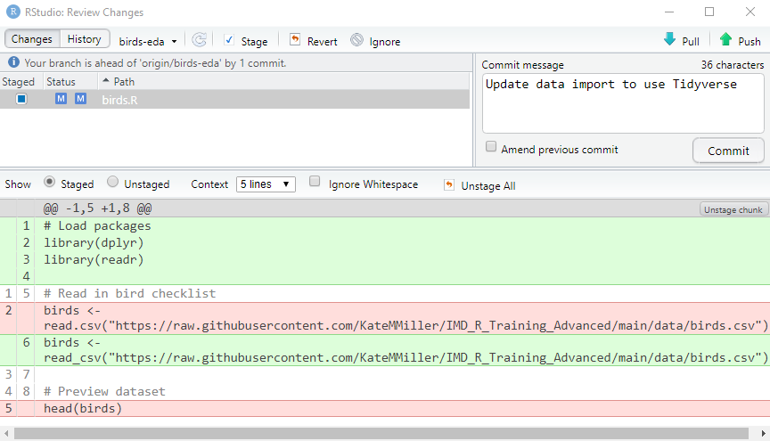
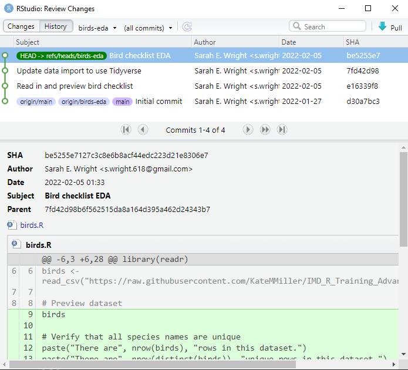
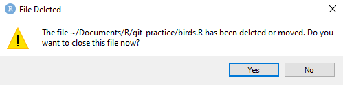
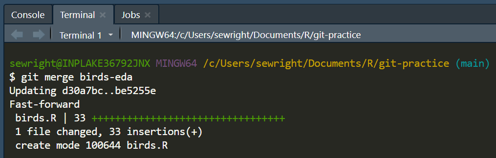
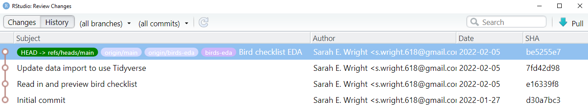
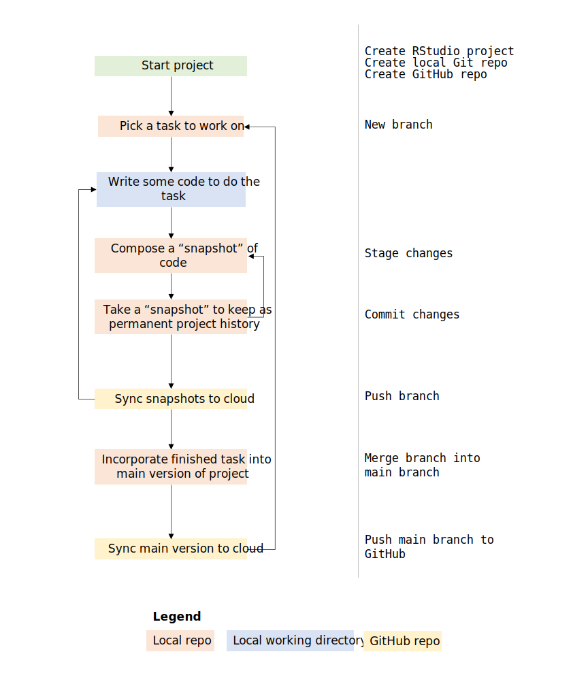

#### Working by yourself

Version control is essential to effective collaboration on code projects, but it's also an incredibly useful tool when you're working by yourself. It's also a great way to get more familiar with the version control workflow without the added complexity of working with collaborators.

##### Branching

If you are adding a new feature to your code, it's good practice to create a new branch to work from. Examples of things you might create a branch for are a new analysis, a complex map or plot, or a few simple maps or plots. You might also create a new branch to fix or improve existing functionality.

Ideally, you should not work from the main branch. Instead, reserve it for the most recent version of your project that is *known to work*. Later in this lesson you'll learn how to incorporate code from another branch back into the main branch.

To create a new branch from RStudio, go to the Git tab and click on the branch  icon. Pick a concise but descriptive name for your new branch. For this class, call it `birds-eda` since we'll be doing some exploratory data analysis on a bird checklist.

*Tip: it's common to format branch names as all lowercase with words separated by dashes.*

Leave the **Remote** dropdown set to "origin" and leave the **Sync branch with remote** box checked. This just means to use the GitHub repository we set up in the last lesson and automatically create a new branch there to match our local one. If you uncheck the box, you will not be able to push your branch to GitHub.

Click **Create.** Look at the Git tab. Your current branch (top left corner) should be the branch you just created. Click on the dropdown to see all of your branches. *LOCAL BRANCHES* refers to the branches in the repository on your local hard drive. *REMOTE:ORIGIN* refers to the branches in the connected GitHub repository. You can more or less ignore the stuff under REMOTE:ORIGIN and just focus on your local branches. If you do click on one of the REMOTE:ORIGIN branches, Git will try to sync any new changes from that GitHub branch to your corresponding local branch.



##### Staging and committing

As you saw when you created a new repository in GitHub, tracking changes in Git is a manual process. When you create a new file, you must tell Git to begin tracking it. Untracked files are designated by a yellow question mark . 

To practice, go ahead and create a new R script. Paste in the following code and save it as `birds.R`.

```{r echo=TRUE, eval=FALSE}
# Read in bird checklist
birds <- read.csv("https://raw.githubusercontent.com/KateMMiller/IMD_R_Training_Advanced/main/data/birds.csv")

# Preview dataset
head(birds)

```

Time to stage and commit the new script. Click on the **Commit** button in the **Git** tab. Check the box in the **Staged** column. Notice that the code you just added is highlighted below in green. That's Git's way of indicating lines that were added since the last commit. `birds.R` is a new file, so everything is green. Add a commit message and click **Commit**.



Notice the message in the **Git** tab: {height=20px} This means that you now have one commit in your local repository that doesn't exist in your GitHub repository. We'll make one more commit and then we'll get in sync with GitHub.

We created this branch for exploratory data analysis, so let's do some. We'll change our current code to use the Tidyverse, then explore the dataset a little. Replace the contents of `birds.R` with the following:

```{r echo=TRUE, eval=FALSE}
# Load packages
library(dplyr)
library(readr)

# Read in bird checklist
birds <- read_csv("https://raw.githubusercontent.com/KateMMiller/IMD_R_Training_Advanced/main/data/birds.csv")

# Preview dataset
birds

# Verify that all species names are unique
paste("There are", nrow(birds), "rows in this dataset.")
paste("There are", nrow(distinct(birds)), "unique rows in this dataset.")

# How many species groups are there?
paste("There are", n_distinct(birds$species_group), "species groups.")

# Any missing data?
any(is.na(birds$species_group))
any(is.na(birds$primary_com_name))

# Count species in each species group
group_size <- birds %>%
  group_by(species_group) %>%
  summarize(species_count = n()) %>%
  arrange(-species_count) %>%
  ungroup()

# What are the largest species groups?
group_size

# What are the smallest species groups?
tail(group_size)

```

You know the drill at this point. Save the file and open the commit window (**Git tab > Commit**), but don't check the box in the **Staged** column yet. 

Notice the lines in red. Git parses a change to a line of code as the deletion of the original line and the addition of a new line with the change applied. Lines with no red or green highlighting are lines that haven't changed. In longer files, Git will hide unchanged lines, so don't panic if you see this - your code hasn't disappeared.

Now we're going to see why the two-part process of staging and committing is so useful. We did two things when we updated `birds.R` - we updated the data import code, and then we did some exploratory data analysis (EDA). It would be nice for our commit history to reflect those distinct changes. Click on line 1 (`# Load packages`), hold down the Shift key, and click on line 9 (`birds`) to highlight the chunk of data import code that we changed. It should be selected in blue. At the top of the selection, click on the **Stage selection** button.



At the top of the code preview, toggle **Show** from **Unstaged** to **Staged**. Instead of staging all of our edits to `birds.R`, we only staged the edits we highlighted. Go ahead and commit those staged changes.

Since we didn't commit everything, our EDA code still shows up as unstaged. Stage it now and commit it, but don't close out the **Review Changes** window.



In the top left of the **Review Changes** window, click on **History**. Here you can review your project's commit history. Each row is a commit. Since we wrote helpful commit messages, it's easy to get a sense of what has been done.

Right now we're just looking at the history for the `birds-eda` branch, but you can use the dropdown next to the **History** button to view history for other branches or for the whole project.



The colored labels indicate branches. `HEAD -> refs/heads/birds-eda` means you are currently on the `birds-eda` branch. If we switched to the `main` branch, it would then be labeled `HEAD -> refs/heads/main` and the tracked files in our project folder would change to reflect the state of the `main` branch. Branches whose labels start with `origin/` are the branches in your GitHub repository.

You can click on a commit to see what changes are part of that commit and which files were involved. The alphanumeric nonsense labeled *SHA* is just a unique identifier for that commit. 

(If you're interested, *SHA* stands for *Simple Hashing Algorithm*. The contents of the commit get fed into an algorithm that generates a *checksum*, a unique identifier for that commit.)


##### Pushing to GitHub

Now that you've made a few commits, you should push your `birds-eda` branch to GitHub. That way, it's backed up in case of hard drive failure. It'll also be easier to share the code with other people. Verify that you don't have any uncommitted changes, then use the green **Push** arrow {height=20px} to push `birds-eda` to GitHub. You can find this button in the **Git** tab or in the **Review Changes** (commit) window. Both buttons do the same thing. You'll get some feedback that the branch was pushed; you can close that window once you verify that there are no error messages.

**Note:** Pushing a branch to GitHub *only* pushes commits made to that branch. If you have uncommitted work or work in other branches, it *will not* end up in GitHub.

##### Merging

In a typical project, you will repeat the process of staging, committing, and pushing a few times before your branch is ready to become part of the working, authoritative version of the project that is the `main` branch. You'll also want to make sure to test the code in your branch thoroughly to make sure that it works!

For the purposes of our demo project, we'll say that we're done with EDA and `birds-eda` is ready to be included in `main`. To do this, we  *merge* `birds-eda` into `main`.

You must be on a branch (`main`) to merge another branch (`birds-eda`) into it. In the **Git** tab, click on the branch dropdown (it should currently say **birds-eda**), and switch to your local `main` branch. You will now see a popup that strikes fear into the hearts of the uninitiated:



Don't panic. When you switch to a different branch, the files in your project directory will update to reflect the series of commits that are part of that branch. There's only one commit on `main` - the initial one. You can verify this by clicking the **History** button {height=20px} in the **Git** tab. `birds.R` doesn't exist in the `main` branch yet, but if you switch back to `birds-eda` it will return.

Now, we get to feel like real hackers for a minute. Navigate to the **Terminal** tab in the bottom right pane of RStudio. Verify that you are on the `main` branch, then type the below command. Pay attention to spacing, punctuation, and capitalization - typos are the most common reason that Git commands fail.

```
git merge birds-eda
```

Hit **Enter**. You should see some feedback in the terminal:



You can verify that the merge was successful by looking in the **Files** tab - you should now see `birds.R`.

The last step is to get the `main` branch in GitHub back in sync with the local `main` branch. Same as you did with `birds-eda` earlier, we'll *push* our local branch to GitHub by clicking on the green **Push** arrow.

If you look at your commit history, you can see that all branches are now up to date with `birds-eda`.



Congratulations! Now you have the skills you need to start using version control for your code projects.

At this point, the workflow from earlier should make a little more sense.



##### Guidelines

As you practice this workflow, here are some guidelines to keep in mind:

  - **Commit (snapshot) your work often:**  Small, specific commits make it easier to undo mistakes later.
  - **Write useful commit messages:**  Be brief but descriptive; [resist the urge to save time with generic messages](https://xkcd.com/1296).
  - **Push to GitHub often:**  If your hard drive fails, this is your backup.
  - **The main branch should work:**  Don't merge code into the `main` branch if you know it's broken (but if it happens, don't panic - just fix the bug on a new branch and merge back into `main`).
