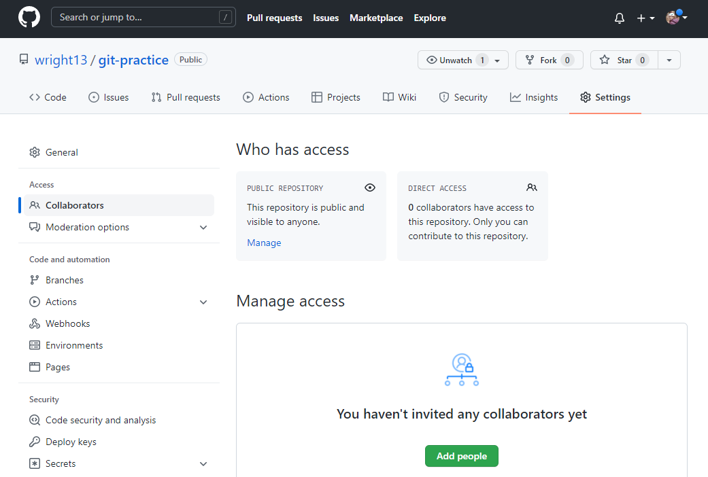
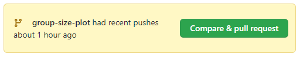
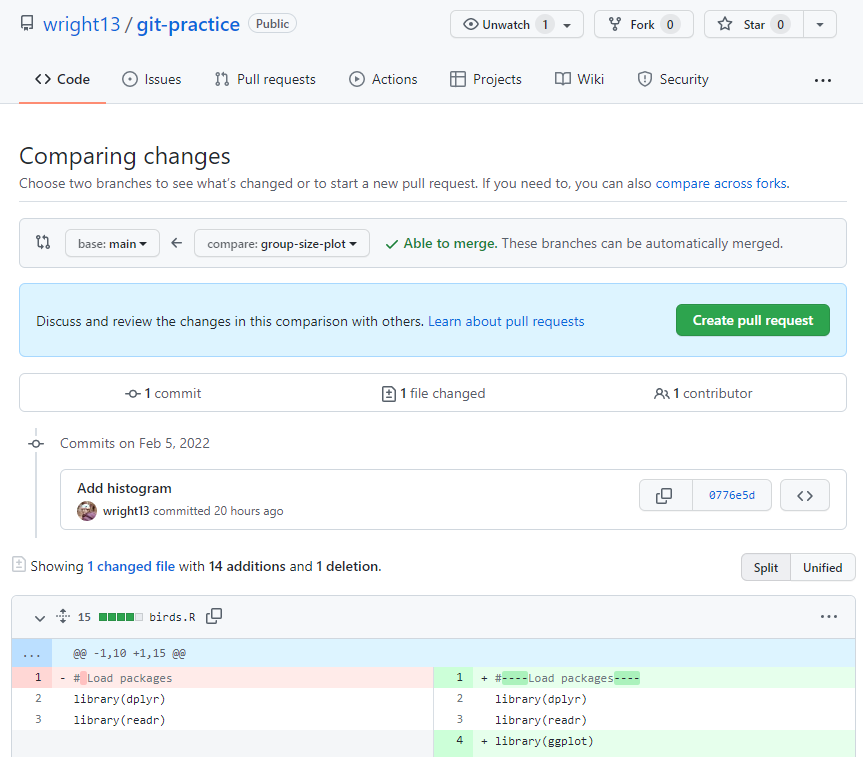
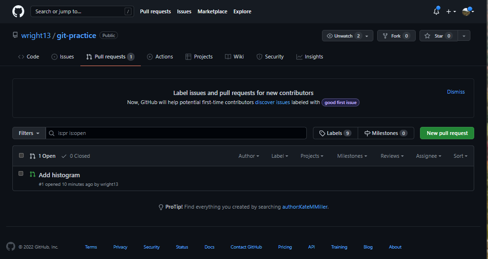
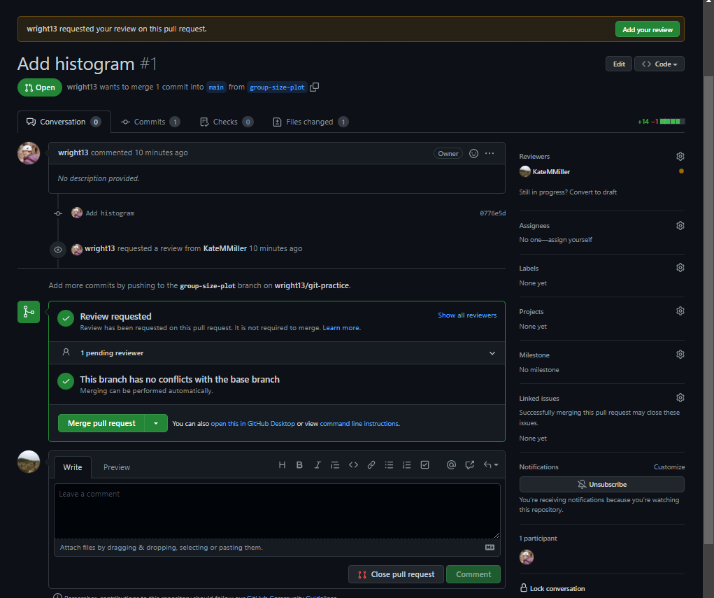
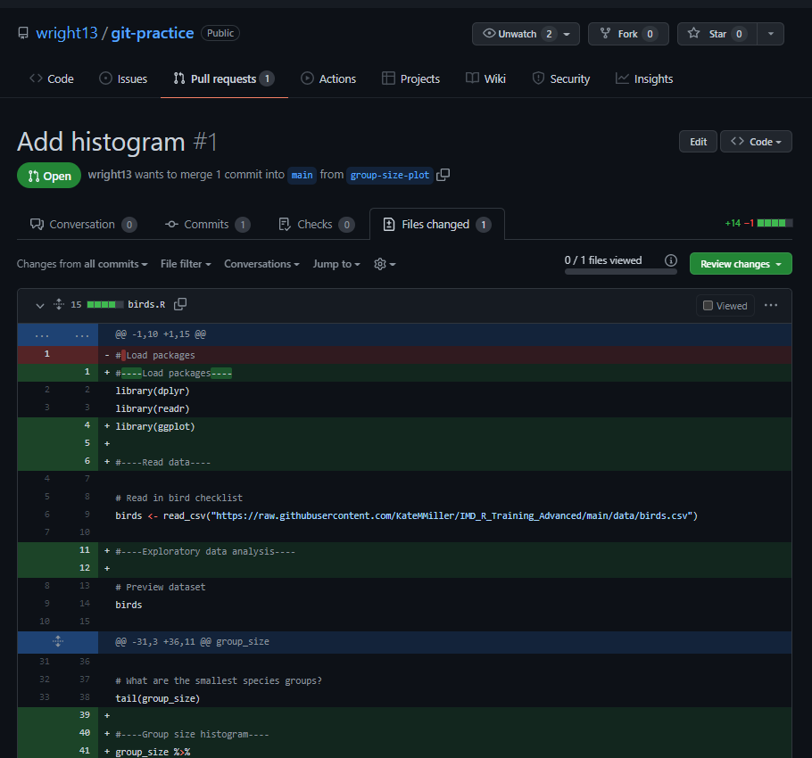
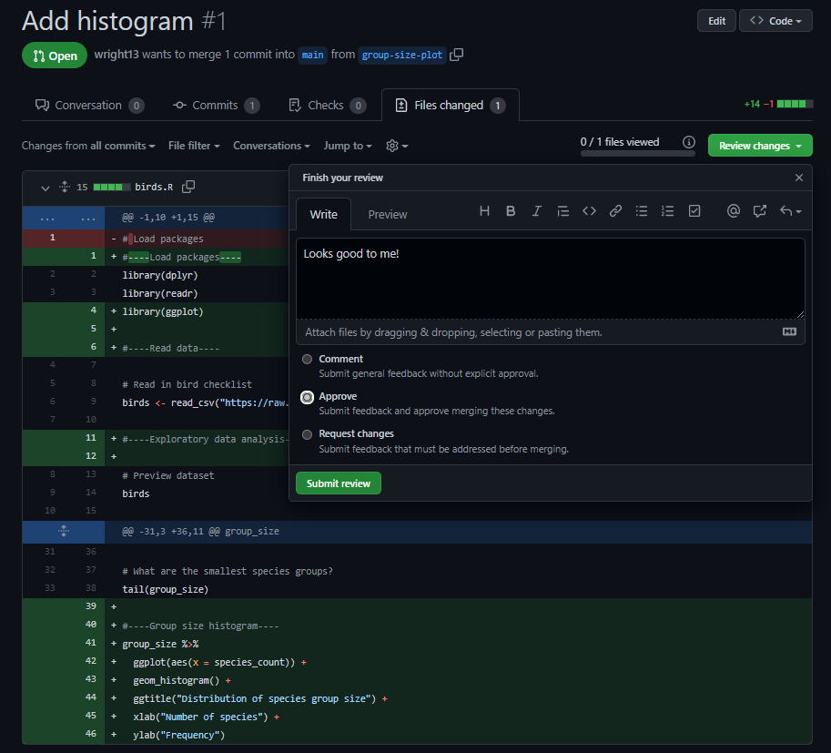
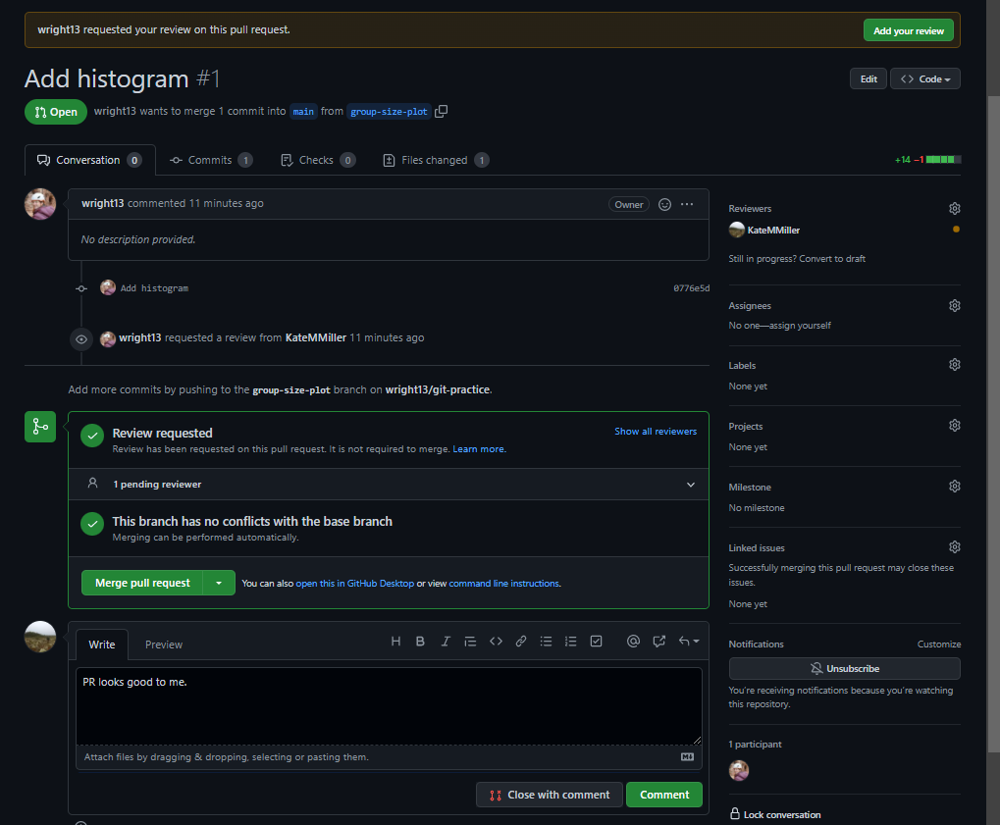
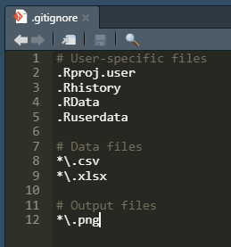

#### Working with others

Collaborating with others in a shared GitHub repository can feel complicated at first, but the learning investment will quickly pay off. The ability to easily identify your collaborators' changes, review their code, and automatically combine your changes into a single authoritative version is well worth the initial challenges.

##### Setup

The first step to collaborating in a shared GitHub repository is to give everyone access to it. From your `git-practice` repository in GitHub, navigate to **Settings > Collaborators**. Even if your repository is public, only collaborators that you designate will be able to push to it. Click on the green **Add people** button and enter the username(s) you would like to add. Your collaborator(s) will then receive a notification that they have been invited to your repository. Once they accept, they will be able to push to your repository.



Your collaborator(s) can now *clone* your GitHub repository, creating their own local Git repositories. When they push a branch to GitHub, it will update the corresponding branch in your GitHub repository. Follow the instructions for **New project from existing GitHub repo** at the bottom of the **Git and RStudio** tab of this website to clone a GitHub repository.

##### Branching

The good news is that most aspects of a collaborative workflow are more or less the same as if you were working on your own. Continuing with the bird checklist project, let's do some data visualization. We'll create one plot and one word cloud, splitting the work between two people. From the `main` branch, one person will create a new branch called `group-size-plot` and the other will create a branch called `species-wordcloud`, making sure to leave the **Sync branch with remote** box checked.

To keep things simple, we'll all continue to work from `birds.R`.

##### Staging and committing

**Collaborator 1**  
On the `group-size-plot` branch, modify `birds.R` to load `ggplot` and create a histogram of species group size. You can just replace the contents of `birds.R` with the following. Notice that there's a line at the top to load `ggplot` and a section at the bottom to create the histogram. In addition, we've added section headers to organize our code a bit.

```{r echo=TRUE, eval=FALSE}
#----Load packages----
library(dplyr)
library(readr)
library(ggplot)

#----Read data----

# Read in bird checklist
birds <- read_csv("https://raw.githubusercontent.com/KateMMiller/IMD_R_Training_Advanced/main/data/birds.csv")

#----Exploratory data analysis----

# Preview dataset
birds

# Verify that all species names are unique
paste("There are", nrow(birds), "rows in this dataset.")
paste("There are", nrow(distinct(birds)), "unique rows in this dataset.")

# How many species groups are there?
paste("There are", n_distinct(birds$species_group), "species groups.")

# Any missing data?
any(is.na(birds$species_group))
any(is.na(birds$primary_com_name))

# Count species in each species group
group_size <- birds %>%
  group_by(species_group) %>%
  summarize(species_count = n()) %>%
  arrange(-species_count) %>%
  ungroup()

# What are the largest species groups?
group_size

# What are the smallest species groups?
tail(group_size)

#----Group size histogram----
group_size %>%
  ggplot(aes(x = species_count)) +
  geom_histogram() +
  ggtitle("Distribution of species group size") +
  xlab("Number of species") +
  ylab("Frequency")

```

Stage and commit your changes, and push the `group-size-plot` branch to GitHub.

**Collaborator 2**  
On the `species-wordcloud` branch, we'll modify `birds.r` to load the `ggwordcloud` package and make a wordcloud of the words that appear in bird species names. We'll save the wordcloud as a PNG. Make sure you're on the right branch before you make changes!

```{r echo=TRUE, eval=FALSE}
# Load packages
library(dplyr)
library(readr)
library(ggwordcloud)
library(stringr)

# Read in bird checklist
birds <- read_csv("https://raw.githubusercontent.com/KateMMiller/IMD_R_Training_Advanced/main/data/birds.csv")

# Preview dataset
birds

# Verify that all species names are unique
paste("There are", nrow(birds), "rows in this dataset.")
paste("There are", nrow(distinct(birds)), "unique rows in this dataset.")

# How many species groups are there?
paste("There are", n_distinct(birds$species_group), "species groups.")

# Any missing data?
any(is.na(birds$species_group))
any(is.na(birds$primary_com_name))

# Count species in each species group
group_size <- birds %>%
  group_by(species_group) %>%
  summarize(species_count = n()) %>%
  arrange(-species_count) %>%
  ungroup()

# What are the largest species groups?
group_size

# What are the smallest species groups?
tail(group_size)

## Species description wordcloud

# Remove the type of bird (last word in the species name)
bird_words <- birds %>%
  mutate(primary_com_name = str_replace(primary_com_name, "\\b(\\w+)$", ""),
         primary_com_name = str_replace_all(primary_com_name, "-", " "),
         primary_com_name = trimws(primary_com_name),
         primary_com_name = tolower(primary_com_name)) %>%
  filter(primary_com_name != "")

# Split species descriptions into single words
bird_words <- paste(bird_words$primary_com_name, collapse = " ") %>%
  str_split(boundary("word"), simplify = TRUE) %>%
  as.vector()

# Get frequency of each word
bird_words_df <- tibble(word = bird_words) %>%
  group_by(word) %>%
  summarise(freq = n()) %>%
  arrange(-freq) %>%
  filter(freq > 10) %>%
  mutate(angle = 90 * sample(c(-1:1), n(), replace = TRUE, prob = c(1, 3, 1)))

# Make the word cloud
n_words <- 100  # Number of words to include
ggplot(bird_words_df[1:n_words,],
                         aes(label = word, size = freq, 
                             color = sample.int(10, n_words, replace = TRUE),
                             angle = angle)) +
  geom_text_wordcloud_area() + 
  scale_size_area(max_size = 20) +
  theme_minimal() +
  scale_color_continuous(type = "viridis")

ggsave("birds_wordcloud.png", bg = "white")

```

Stage and commit your changes to `birds.R`, but don't include the PNG. Leave it as-is with the yellow question marks; we'll talk more about it later. Push the `species-wordcloud` branch to GitHub.

##### Pulling and pull requests
At this point, we are ready for the main branch to reflect our new changes. This is where the workflow gets a little different than if you are working by yourself. You can't just merge your changes into your local `main` branch and push it, because the `main` branch on GitHub could contain other people's commits that you don't have locally. It's also a good idea to let your collaborators review your code before it gets merged into the `main` branch of the shared GitHub repository, so don't push your local `main` branch to a shared GitHub repo!

**Collaborator 1**  
Let's work on incorporating the `group-size-plot` branch into both the local and remote (GitHub) versions of `main`. 

First, we need to check whether anyone else has made changes to `main`, so we'll *pull* it. Switch to your local `main` branch, then click on the blue **Pull** arrow {height=20px} in the **Git** tab. This retrieves the GitHub version of that branch and merges it into your local version. A **Git Pull** window should pop up and let you know that your branch is already up to date. Switch back to `group-size-plot`.

Next, we'll go to GitHub and create a *pull request*. This terminology is kind of confusing, because the goal of this pull request is to *merge* the `group-size-plot` branch on GitHub into the `main` branch on GitHub. Think of it this way: you are asking your collaborator to *pull* your branch, review it, and then merge it into `main` if all looks good. Why isn't it called a merge request? Because sometimes you just want feedback on your code and aren't ready to merge it into `main`.

Navigate to your repository on GitHub. You may see a notification that `group-size-plot` was recently pushed. If so, you can click the **Compare & pull request** button in the notification. 



Alternately, you can navigate to **Pull requests > New pull request**, select `group-size-plot` in the **Compare** dropdown, then click **Create pull request**.



At this point, you can add a note to your pull request, tag a reviewer, and look over the differences between your branch and `main`. It can be helpful to include a brief summary of what you did and indicate whether you think it's ready to merge into `main` or would just like a code review.

When you are ready, click on **Create pull request**. 

**Collaborator 2**  
In your GitHub repository, you'll see a badge next to **Pull requests** with a "1" on it, indicating that there is one open pull request. Navigate to **Pull requests** and click on the one your collaborator just created. 



You can look at the **Commits** and **Files changed** tabs to see what was done. It's also a good idea to pull the `group-size-plot` down to your local repository so that you can actually run the code and verify that it works for you. From the **Git** tab in RStudio, use the branch dropdown to switch to `group-size-plot`. If you don't see it in your local branches, look under **Remote:Origin**. Clicking on it will create a local version of the branch.



Run the code and verify that it works. When you're satisfied, go back to the pull request review on GitHub. If you see a message that your review was requested, click on the green **Add your review** button at the top of the screen. This will take you to the **Files changed** page where you can make comments on specific lines of code and decide whether to approve merging it into the main branch, request changes before it is merged, or just provide general feedback.

{width=50%}  {width=50%}

For the purposes of this class, we'll go ahead and approve the request and merge `group-size-plot` into `main`. In real life, you may want to request corrections or improvements before merging. Go back to the **Conversation** tab for the pull request, add any comments you would like, then click on the green **Merge pull request** button.



Now our local `main` branch needs to be updated, so switch to it in RStudio and click **Pull**.

We're almost ready to repeat the pull request process for `species-wordcloud`, but first we need to make sure that the code in `species-wordcloud` works with the latest updates to `main`. To do this, we'll merge our local `main` branch into `species-wordcloud`. Switch to `species-wordcloud` in RStudio, then type the following at the terminal:

```
git merge main
```

Whoops - we've encountererd a merge conflict. This happened because `species-wordcloud` and `group-size-plot` made different changes to the same lines in `birds.R`. We just need to manually resolve the conflict, because Git doesn't have any way of knowing which changes it should keep. To do this, we just edit the offending files (designated by an orange "U" in the **Git** tab). The first few lines of `birds.R` now look like this:

```{r echo=FALSE, eval=FALSE}
#----Load packages----
library(dplyr)
library(readr)
<<<<<<< HEAD
library(ggwordcloud)
library(stringr)
=======
library(ggplot)

#----Read data----
>>>>>>> main

# Read in bird checklist
birds <- read_csv("https://raw.githubusercontent.com/KateMMiller/IMD_R_Training_Advanced/main/data/birds.csv")
```

The code between `<<<<<<< HEAD` and `=======` is what's in our current branch, `species-wordcloud`. The code between `=======` and `>>>>>>> main` is what's in the branch we're trying to merge, `main`. In this case, we want to keep all of it, so we'll just delete `<<<<<<< HEAD`, `=======`, and `>>>>>>> main`.

Scroll down to the bottom of the file, where the other merge conflict is, and repeat the same process. In this case we're keeping the additions to `birds.R` from both branches, but there will be cases where you need to decide which version to keep or modify your code to combine parts of both.

Sometimes merge conflicts can get confusing. You can start over by typing `git merge --abort` at the terminal, which takes you back to before the merge conflict. Then just re-do the merge and try again.

```{r echo=FALSE, eval=FALSE}
# What are the smallest species groups?
tail(group_size)

<<<<<<< HEAD
## Species description wordcloud

# Remove the type of bird (last word in the species name)
bird_words <- birds %>%
  mutate(primary_com_name = str_replace(primary_com_name, "\\b(\\w+)$", ""),
         primary_com_name = str_replace_all(primary_com_name, "-", " "),
         primary_com_name = trimws(primary_com_name),
         primary_com_name = tolower(primary_com_name)) %>%
  filter(primary_com_name != "")

# Split species descriptions into single words
bird_words <- paste(bird_words$primary_com_name, collapse = " ") %>%
  str_split(boundary("word"), simplify = TRUE) %>%
  as.vector()

# Get frequency of each word
bird_words_df <- tibble(word = bird_words) %>%
  group_by(word) %>%
  summarise(freq = n()) %>%
  arrange(-freq) %>%
  filter(freq > 10) %>%
  mutate(angle = 90 * sample(c(-1:1), n(), replace = TRUE, prob = c(1, 3, 1)))

# Make the word cloud
n_words <- 100  # Number of words to include
ggplot(bird_words_df[1:n_words,],
                         aes(label = word, size = freq, 
                             color = sample.int(10, n_words, replace = TRUE),
                             angle = angle)) +
  geom_text_wordcloud_area() + 
  scale_size_area(max_size = 20) +
  theme_minimal() +
  scale_color_continuous(type = "viridis")

ggsave("birds_wordcloud.png", bg = "white")
=======
#----Group size histogram----
group_size %>%
  ggplot(aes(x = species_count)) +
  geom_histogram() +
  ggtitle("Distribution of species group size") +
  xlab("Number of species") +
  ylab("Frequency")
>>>>>>> main

```

When you are done resolving the merge conflict, commit your changes and push to GitHub. Now you can follow the steps above to create your own pull request. When that pull request has been merged, `main` will contain the work of both collaborators.

##### Ignoring files in Git

You'll often have files in your project that you don't want to include in its permanent history. This could include things like data, database connection information, or user-specific configuration files.

Depending on the situation, you also may want to avoid tracking files generated by your code, since you can just recreate an up to date version of these files by rerunning your code.

Throughout this whole process, `birds-wordcloud.png` has been floating around as an untracked file. We don't really need to store it in the Git repository since we can just generate it from `birds.R`, but it's annoying that it's sitting there with the yellow question marks. 

This is where the `.gitignore` file comes in handy. Open it up, and on a new line add the name of the file or folder you want Git to ignore - in this case, `birds-wordcloud.png`. It will take effect when you save `.gitignore` but you may need to click the refresh icon in the top right of the **Git** tab to see the files disappear from the status view.



Commit and push your changes to `.gitignore`.

*Tip: You can also use a [regular expression](https://r4ds.had.co.nz/strings.html#matching-patterns-with-regular-expressions) to specify multiple filenames matching a certain pattern. *

##### Guidelines

  - **Communicate with your collaborators:**  No collaboration tool replaces human communication. The easiest way to avoid problems is to make sure that nobody is working on the same section of code at the same time.
  - **Once a commit has been pushed to GitHub, don't modify it:**  Unless you know what you're doing, don't use `git reset`, `git commit --amend`, or the **Amend previous commit** box in RStudio. This will cause problems for your teammates.
  - **Avoid the `--force` option:**  Force pushing or force pulling a branch will create headaches and possibly lost work if you do it wrong. Don't do this unless you know what you're doing, and if you do, make sure to talk to your collaborators if shared branches are affected.
