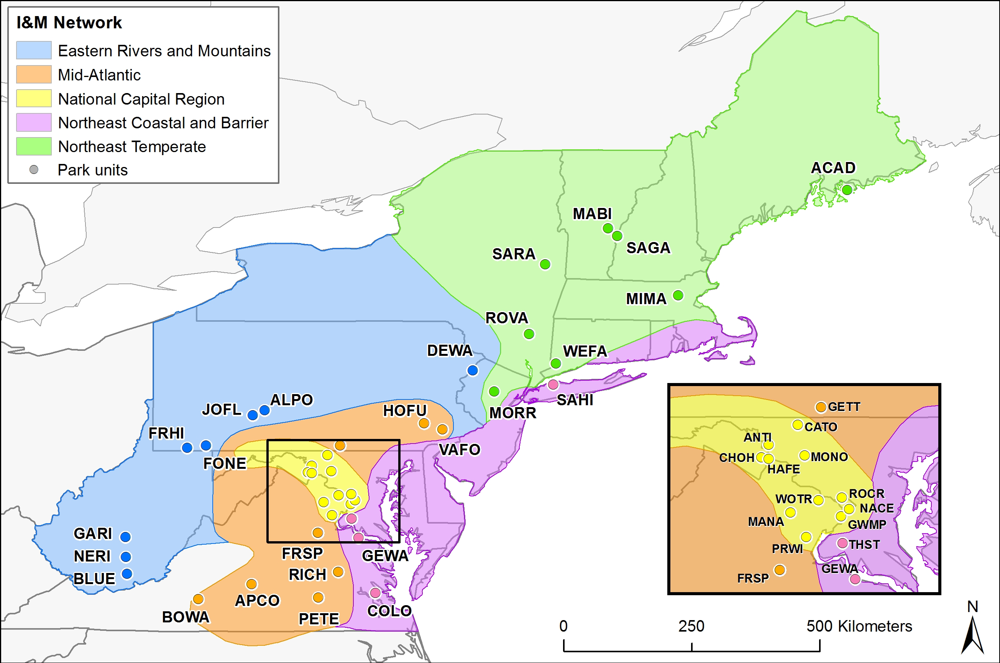

```{r setup, include = FALSE}
knitr::opts_chunk$set(echo = FALSE, fig.align = "left", out.width = "50%")
```
```{r wordlibs, include = FALSE}
library(officer)
library(officedown)
library(flextable) # for tables
library(mschart) # for figures

```

```{r fkinv, include = FALSE}
library(dplyr)
library(ggplot2)
library(tidyr)
devtools::source_url("https://raw.githubusercontent.com/KateMMiller/IMD_R_Training_Advanced/main/Generate_fake_invasive_data_and_plots.R")

# invplot_fun to show params
invplot_fun <- function(data, park){
  p <-   
  ggplot(data %>% filter(park == park), 
         aes(x = cycle, y = inv_cover))+
    geom_jitter(color = "#69A466", width = 0.1) +
    geom_boxplot(aes(group = cycle), width = 0.18, lwd = 0.4, alpha = 0)+
    theme_bw()+
    theme(panel.grid.major = element_blank(), 
          panel.grid.minor = element_blank()) +
    labs(x = 'Cycle', y = "Invasive % Cover") +
    scale_x_continuous(limits = c(0.9, 3.1), breaks = c(1, 2, 3)) 
return(p)
}

```

## Introduction
The Northeast Temperate Network (NETN) of the National Park Service (NPS) Inventory and Monitoring Program developed a long-term monitoring program for forest resources in response to the identification of Forest Vegetation as a high-priority vital sign for the network (Mitchell et al. 2006). This program also provides data for three additional high-priority vital signs: Forest Soil Condition, White-tailed Deer Herbivory, and Landscape Context. The overall goal of the forest monitoring program is to assess status and trends in the composition, structure, and function of NETN forested ecosystems. 

Adapted from the U.S. Forest Service Forest Inventory and Analysis Program, the NETN forest protocol monitors a representative suite of site and vegetation measures in an extensive network of randomly located permanent plots (Tierney et al. 2019). The following parks are monitored in this program: Acadia National Park (ACAD), Marsh-Billings-Rockefeller National Historical Park (MABI), Minute Man National Historical Park (MIMA), Morristown National Historical Park (MORR), Roosevelt-Vanderbilt National Historic Sites (ROVA), Saint-Gaudens National Historic Site (SAGA), Saratoga National Historical Park (SARA), and Weir Farm National Historic Site (WEFA; Figure \@ref(fig:netnmap)). Roosevelt-Vanderbilt National Historic Sites includes Eleanor Roosevelt National Historic Site (ELRO), Home of Franklin D. Roosevelt National Historic Site (HOFR), and Vanderbilt Mansion National Historic Site (VAMA). This report summarizes data collected in ACAD, MABI and SAGA from 2008 -- 2019. For more on the forest monitoring protocol, refer to the [Long-term Forest Monitoring protocol](https://irma.nps.gov/DataStore/Reference/Profile/2247950).

```{r netnmap, echo = F, fig.cap = "Map of parks in the Northeast Temperate Network"}


```

## Methods
Permanent forest plots have been installed and are sampled every 4 years using a rotating four-panel design. One panel is sampled each year at ACAD (one-fourth of the plots are sampled during each of the four sampling panels) and in alternate years at the nine national historical parks and historic sites (one-half of the plots at each park are sampled during each of two sampling panels per park). Because ELRO and HOFR are adjacent park units, the sampling design treats them as a single unit. It is not possible to report on these parks individually because there is not a sufficient sample size at ELRO to support a stand-alone analysis. 
Plots were randomly located within each park using generalized random tessellation stratified sampling (GRTS; Stevens and Olsen 2004). GRTS points which were located in areas that were primarily forested or succeeding to forest were established as forest plots, as long as they were ≥ 15 m from a road (including a carriage road), a perennial stream or water body large enough to create a canopy opening, a mowed area, or the park boundary. Plots in areas receiving management, such as logging and invasive species removal, are included in the target population as long as plots are not being specifically targeted for the management. That is, NETN forest plots should be representative of park forests and should not receive preferential treatment. In one case, a GRTS point was located in a 4 ha deer exclosure in MORR. Because this point was part of the random GRTS sample and met the pre-defined target population guidelines, it was not excluded from analyses. However, major differences between this plot and those outside of exclosures will be noted in ecological integrity metrics and trend analyses. 

The number of plots sampled by cycle are summarized in Table \@ref(tab:pkable). This analysis focuses on the invasive plant cover and forest canopy cover. 

```{r ptable, include = FALSE}
plot_table <- invdata %>% group_by(park, cycle) %>% 
  summarize(num_plots = length(unique(Plot_Name)), 
            .groups = 'drop') %>% 
  pivot_wider(names_from = cycle, 
              values_from = num_plots,
              names_prefix = "Cycle") 
```

```{r ftable, include = FALSE}
library(flextable)
plot_ftable <- flextable(plot_table)
set_caption(plot_ftable, "Number of plots per cycle in NETN.")
```

```{r tabplot, echo = F}
plot_ftable
```

## Results
We found overall invasive cover to be lowest in ACAD and highest in SARA (Figure 1). Invasive cover also appears to be decreasing in ACAD, where as invasive cover is relatively stable in other parks. Canopy cover appears to be negatively associated with invasive cover (Figure 2).

```{r fig-inv-all, echo = F, fig.cap = "Trends in invasive plant cover in NETN parks."}
invplot_all
```

```{r fig-inv-can, echo = F, fig.cap = "Plot of canopy cover versus invasive cover."}
can_vs_inv
```

```{r inv-park, echo = F, fig.cap = paste0("Invasive trends in plant cover in ", params$park_long, ".")}
invplot_fun(invdata, park = params$park)
```


## Literature Cited
<p class = 'litcited'>
Mitchell, B. R., W. G. Shriver, F. Dieffenbach, T. Moore, D. Faber-Langendoen, G. Tierney, P. Lombard, and J. Gibbs. 2006. Northeast Temperate Network Vital Signs Monitoring Plan. Technical Report NPS/NER/NRTR – 2006/059. National Park Service, Northeast Temperate Network, Woodstock, Vermont.</p>

<p class = 'litcited'>
Stevens, Don L., Jr., and A. R. Olsen. 2004. Spatially balanced sampling of natural resources. Journal of the American Statistical Association 99:262-278.</p>

<p class = 'litcited'>
Tierney, G. L., B. R. Mitchell, K. M. Miller, J. Comiskey, A. Kozlowski, and D. Faber-Langendoen. 2014. Northeast Temperate Network long-term forest monitoring protocol: 2014 revision. Natural Resource Report NPS/NETN/NRR—2014/805. National Park Service, Fort Collins, Colorado.</p>

